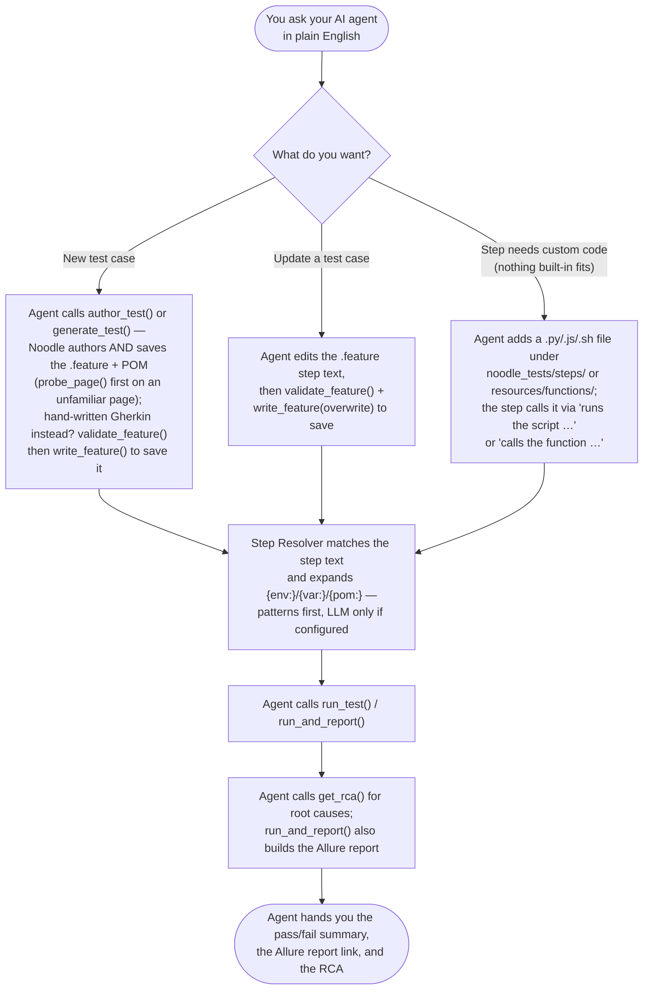
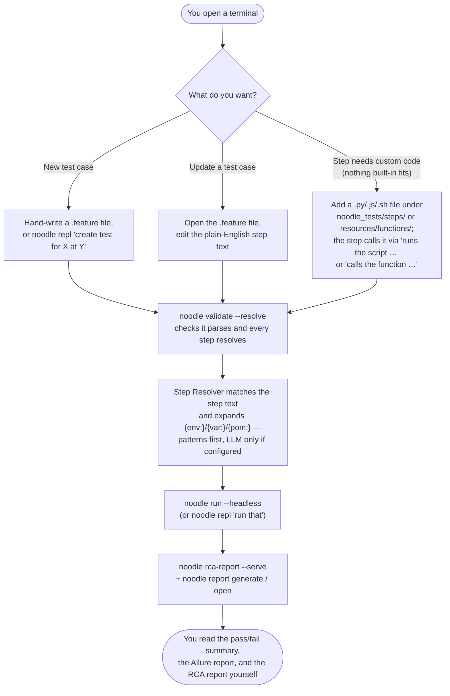

<p align="center">
  
</p>

# Noodle Test Framework

**Tell Noodle what to test. It writes the noodles, so you don't have to.**

No selectors. No Page Object classes. No step definitions. No code.

```gherkin
@web @smoke
Scenario: Valid user can log in
  Given User is on "{env:SAUCEDEMO}"
  When User enters {env:SAUCE_USERNAME} in the username field
  And User clicks the login button
  Then User should see "Products"
```

`{env:SAUCEDEMO}` resolves from `environments.yaml`. `{env:SAUCE_USERNAME}` from `secrets.env`.

**This README is the front door** — what Noodle is, how it works, and
copy/paste quickstarts for macOS, Windows 11, CI, and AI coding agents.
Everything deeper (detailed setup, writing tests, RCA, reference,
troubleshooting) is one hop away in [docs/manual.md](docs/manual.md).
No prior AI, automation, or Python experience assumed.

> **AI agent — were you just told something like "read this README and
> install Noodle for me," with nothing more specific?** That means:
> [Zero to hero — let your agent install it](#zero-to-hero--let-your-agent-install-it)'s
> **install-only** prompt, further down this file. In short — detect the
> OS you're on, install the CLI + prerequisites + the VS Code extension,
> confirm a `.feature` file actually renders in colour, and stop there.
> Don't run, generate, or start a test app unless you were separately
> asked to.

---

## Contents

- [Docs — where to go deeper](#docs--where-to-go-deeper)
- [What is this?](#what-is-this)
- [Quick answers — for testers & managers](#quick-answers--for-testers--managers)
- [How it works](#how-it-works)
- [Woks — the work areas, and the tags that route them](#woks--the-work-areas-and-the-tags-that-route-them)
- [Zero to hero — copy/paste path](#zero-to-hero--copypaste-path)
  - [macOS](#zero-to-hero--macos)
  - [Windows 11](#zero-to-hero--windows-11)
  - [Azure Pipelines (CI)](#zero-to-hero--azure-pipelines-ci)
  - [Let your agent install it](#zero-to-hero--let-your-agent-install-it)
- [Connect an AI coding agent (for testers & PMs)](#connect-an-ai-coding-agent-for-testers--pms)
  - [Zero to hero — connect an MCP host](#zero-to-hero--connect-an-mcp-host)
  - [Tester quickstart — smoke tests from your agent's terminal](#tester-quickstart--smoke-tests-from-your-agents-terminal)
  - [Try the bundled samples in your own workspace](#try-the-bundled-samples-in-your-own-workspace)
- [Health check — `noodle doctor`](#health-check--noodle-doctor)
- Everything deeper — full setup guide, writing/running tests, RCA, syntax,
  LLM augmentation, `noodle repl`, CI, quick reference, troubleshooting —
  now lives in **[docs/manual.md](docs/manual.md)**

---

## Docs — where to go deeper

| Doc | For | What's in it |
|-----|-----|--------------|
| **README.md** (this file) | everyone | What this is, how it works, and the copy/paste quickstarts. The front door. |
| [docs/manual.md](docs/manual.md) | everyone | The full manual: detailed setup (Parts 1–7), first test, RCA, syntax, LLM augmentation, `noodle repl`, CI, quick reference, troubleshooting |
| [docs/cli-reference.md](docs/cli-reference.md) | everyone | Every `noodle` command and flag — purpose, when to use it, sample output |
| [docs/encyclopedia.md](docs/encyclopedia.md) | new & veteran testers | The complete how-to: install → write → run → `pom.yaml` → shared state → reports → CI → LLM setup |
| [docs/workspace-guide.md](docs/workspace-guide.md) | manual testers / QE leads | Full walkthrough for a workspace living outside this repo — scaffolding, POM mapping, custom scripts, naming rules, reports |
| [docs/glossary.md](docs/glossary.md) | everyone | The three canonical nouns (**engine** / **workspace** / **wok**) + where to find everything — env vars, YAML files, outputs, resources |
| [docs/steps_dictionary.md](docs/steps_dictionary.md) | testers & maintainers | All built-in step patterns with phrasings and examples — plus [Adding a new step](docs/steps_dictionary.md#adding-a-new-step): the 4-tier ladder, how to add a pattern to `patterns.py`, and why the editor may warn on a step that already matches |
| [docs/woks.md](docs/woks.md) | everyone | The **woks** — Noodle's four capability work areas (web, mobile, desktop, performance): engines, routing tags, cross-wok composition, per-wok unit tests. `noodle wok` lists them |
| [docs/architecture.md](docs/architecture.md) | learning the tech | Deep dive: components, resolution hierarchy, the LLM layer, tech stack |
| [docs/design-history.md](docs/design-history.md) | maintainers | The rationale trail behind every capability, condensed from the build phases — including the retired target-architecture vision sketch and the RCA design plan |
| [docs/codebase-spec.md](docs/codebase-spec.md) | maintainers | Formal repo inventory — every package, entrypoint, data layout, and config surface, as of a point in time. Not a how-to. |
| [docs/feature-packages.md](docs/feature-packages.md) | testers building a new app-under-test | Per-app packaging: `features/`, `resources/`, resolution order, in-repo vs external workspace |
| [docs/native-apps.md](docs/native-apps.md) | testers targeting Android/iOS/Windows 11/macOS | Native-app testing via Appium platform tags, per-platform setup, and the OCR fallback for apps with no accessible names |
| [docs/llm-setup.md](docs/llm-setup.md) | testers configuring an LLM provider | Picking/configuring a model, cloud cost comparison, and reaching an LLM through a locked-down work GitHub/Copilot/Azure account |
| [docs/agent-playbook.md](docs/agent-playbook.md) | AI coding agents | Decision procedure for building/running a Noodle test by driving the CLI directly |
| [.claude/skills/noodle/SKILL.md](.claude/skills/noodle/SKILL.md) | AI coding agents | The playbook condensed into an installable skill (same file at `.copilot/skills/noodle/`) — install steps: [§ Install the noodle skill](#install-the-noodle-skill-claude-code--copilot-cli) |
| [docs/external-site-walkthrough.md](docs/external-site-walkthrough.md) | new users, AI coding agents | Worked example: a real suite built against a live external site, direct-CLI (not `noodle repl`), including the real failures hit and fixed along the way |
| [docs/mcp-guide.md](docs/mcp-guide.md) | AI SDLC integrators | `noodle-mcp` setup, local quickstart, tool reference, design rationale, and MAF / Azure AI Foundry wiring (stdio + remote) |
| [docs/ai-sdlc-integration.md](docs/ai-sdlc-integration.md) | Azure DevOps admins, multi-agent AI SDLC integrators | One-time Azure DevOps setup, wiring a LangChain/MAF agent to generate/run tests via `noodle-mcp`, and a worked multi-agent Squad-pattern example |

**Quick links:**

- **How do I install Noodle and put `noodle` on my PATH?** → [Zero to hero](#zero-to-hero--copypaste-path) below has both options side by side; the permanent-PATH one is also its own step in [Part 2](docs/manual.md#part-2--get-the-framework).
- **Can my AI agent just install this for me — no typing, no test run?** → [Let your agent install it](#zero-to-hero--let-your-agent-install-it) — a paste-able, idempotent prompt that installs the tool and verifies VS Code syntax highlighting, nothing else.
- **How do I run the bundled BusterBlock test app?** → [Manual → Part 5](docs/manual.md#part-5--start-busterblock-the-bundled-test-app).
- **How do I build a full suite against a real external site, end to end?** → [External site walkthrough](docs/external-site-walkthrough.md)
- **How do I seed data before a test (preconditions/teardowns)?** → [Architecture → Component map](docs/architecture.md#2-the-component-map)
- **How do I run a Python/JS/jar/shell script from a step?** → [Encyclopedia → Running scripts & commands](docs/encyclopedia.md#running-scripts--commands)
- **When does the LLM run, and which sample test triggers it?** → [Architecture → The LLM layer](docs/architecture.md#5-the-llm-layer)
- **How does step wording map to `pom.yaml` keys?** → [Encyclopedia → pom.yaml](docs/encyclopedia.md#5-pomyaml--when-natural-naming-fails)
- **Which doc do I need to map my POM — in-repo test or external workspace?** → in-repo: [Encyclopedia → pom.yaml](docs/encyclopedia.md#5-pomyaml--when-natural-naming-fails) (the mechanics of `pom.yaml` itself); external/standalone workspace: [Workspace guide § 3](docs/workspace-guide.md#3-map-page-objects-pom-back-to-your-feature-files) (scaffolding + naming rules for a repo living outside this one)
- **Local agent vs LLM, step by step?** → [Architecture → Resolution hierarchy](docs/architecture.md#4-the-resolution-hierarchy)
- **Every library and why?** → [Manual → Tech stack](docs/manual.md#tech-stack)
- **Full list of built-in steps?** → [Encyclopedia → Built-in step reference](docs/encyclopedia.md#6-built-in-step-reference)

**Plans & historical reviews.** Completed plans and point-in-time reviews
aren't kept as separate files — they're condensed into
[docs/design-history.md](docs/design-history.md) once shipped, and the
shipped capability itself is documented in
[docs/architecture.md](docs/architecture.md) / [docs/encyclopedia.md](docs/encyclopedia.md).

---

## What is this?

Noodle Test Framework lets you write automated tests as plain English
sentences — no code, no CSS selectors, no per-page setup. The framework
reads the sentences, opens a real browser, performs the actions, and checks
the result.

Every step travels through a local pipeline first. An AI model (LLM) is
**off by default** — it's entirely optional, and most tests never need it.

---

## Quick answers — for testers & managers

The five questions people ask before touching anything else. Each answer
is the short version — follow the link if you want the full picture.

**What does "LLM mode" mean?**
LLM = a large language model, i.e. an AI model like Claude or GPT. Most
test steps are plain English that Noodle already recognizes on its own —
no AI involved. "LLM mode" is an optional setting that lets Noodle hand a
step to an AI model when it *doesn't* recognize it, instead of just
failing.

**What's the default LLM mode?**
**Off.** Out of the box, Noodle only understands its ~50 built-in
sentence patterns — no AI model, no cost, nothing ever leaves your
machine. A step it doesn't recognize fails loudly and tells you so,
rather than guessing. You only turn LLM mode on if you actually hit that
wall — see [LLM augmentation](docs/manual.md#llm-augmentation-optional).

**What do I actually use, day to day?**
Almost always the AI coding agent you already have — Claude Code or
GitHub Copilot. You ask it in plain English to write, run, or report on a
test, and it drives Noodle for you; see
[Connect an AI coding agent](#connect-an-ai-coding-agent-for-testers--pms).
Drop into `noodle repl` — Noodle's own built-in chat shell, no AI agent
needed — only if you have neither a company Copilot seat nor a personal
Claude account; it works fully offline, for free, with no AI model
configured at all. Everything under
[Reference (engineers / CI authors)](docs/manual.md#reference-engineers--ci-authors) below
is the manual, no-agent version of the same commands.

**How does Noodle know what a plain-English step means?**
Every step is checked against Noodle's ~50 built-in sentence patterns
first ("clicks the X button", "should see Y", …) — instant, free, no AI.
Only a step that matches nothing, *and* only if you've turned LLM mode on,
gets handed to an AI model instead. See the diagrams in
[How it works](#how-it-works) just below.

**My test lives in a different folder (or a different repo) — how do I run it?**
Noodle is a tool you install once, like `git` — it never needs your tests
inside its own folder.
1. Install Noodle once, as in [Zero to hero](#zero-to-hero--copypaste-path)
   below — you do this regardless of where your tests live.
2. No test folder yet? Create one anywhere: `noodle init ~/projects/my-tests`
   (Windows: `noodle init $HOME\projects\my-tests`) scaffolds everything
   Noodle needs there in one step.
3. Point every command at it with `--workspace`/`-w`, e.g.
   `noodle run --workspace ~/projects/my-tests --headless`. You don't need
   to be inside the Noodle repo *or* inside `my-tests` to run this — your
   current directory doesn't matter, only that the `noodle` command itself
   works in that terminal (venv activated, or installed with Option B so
   it's always on `PATH` — see [Part 2](docs/manual.md#part-2--get-the-framework)). Already
   `cd`'d into `my-tests` — or into one app's folder like
   `my-tests/noodle_tests/app1` (then every command scopes to that app)?
   Drop `--workspace` — it defaults to `.`.
4. Using an AI agent instead of the terminal? Launch the agent **from
   inside** that folder (not from inside the Noodle install folder), and
   point its MCP connection at the same `--workspace` path. Full
   walkthrough: [Zero to hero — connect an MCP host](#zero-to-hero--connect-an-mcp-host).

---

## How it works

Two ways to drive Noodle — same six things happen either way (write a new
test, update one, add custom code for a step nothing built-in covers,
resolve variables/step wording, run the suite, generate the reports); only
*who types what* changes.

**MCP mode** — an AI coding agent (Claude Code, GitHub Copilot) drives
Noodle for you via [MCP](docs/manual.md#mcp-server--noodle-mcp-ai-sdlc) ("Model Context
Protocol" — the standard that lets an AI agent call a tool's functions
directly, the same way it can call `generate_test` or `run_test` below):



**Manual mode** — you type `noodle` commands yourself, no AI agent
involved (with or without `noodle repl`, Noodle's own plain-English shell):



| Mode | `NOODLE_LLM_MODE` | `NOODLE_MODEL` | Behaviour |
|------|---------------------|-----------------|-----------|
| **Off** *(default)* | *(unset)* | *(unset)* | Patterns only. Unresolved step fails loudly. Fully local, zero cost. |
| **Assisted LLM** (fallback) | `auto` *(the default — setting `NOODLE_MODEL` alone is enough)* | set | Patterns first; the model is called only when no pattern matches. |
| **Pure LLM** (full) | `full` | set | Every step goes to the model; patterns skipped. |

> **Two different AIs can be involved — keep them straight.**
> `NOODLE_MODEL` is the **engine-side model** — a hosted model like
> `anthropic/claude-sonnet-5` (recommended), or Ollama on your own machine
> where the network demands it — that the *runner* calls mid-run in
> Assisted/Pure LLM mode. Separately, the **coding agent you are sitting in** (Claude Code
> CLI, GitHub Copilot CLI, Copilot in VS Code, Cursor) can drive Noodle
> from the outside via [MCP](docs/manual.md#mcp-server--noodle-mcp-ai-sdlc): it authors
> the Gherkin, runs it, and reads the results, while the engine stays
> LLM-free. Every step the engine-side model resolves is logged to your
> workspace's `docs/steps_dictionary_suggestions.md` so your agent (or you)
> can promote recurring ones into real patterns later — see
> [Pure LLM mode with a coding agent](docs/manual.md#pure-llm-mode-with-a-coding-agent).

> Full detail on LLM setup, providers, and modes → **[docs/encyclopedia.md § LLM](docs/encyclopedia.md#16-using-an-llm--setup-providers-and-modes)**

---

## Woks — the work areas, and the tags that route them

Noodle tests four kinds of system, each a **wok** (a capability work area —
the name puns on "WOrK area"). You never configure a wok — **the tags at
the top of a `.feature` file (or on one scenario) pick it**, and the engine
sets up the right session before the scenario runs. Same Gherkin, same
screenshots-into-Allure + RCA reporting in all four. Run `noodle wok` to
see them with per-machine install status.

| Wok | Put these tags on the feature/scenario | What the engine starts |
|-----|---|---|
| **Web** *(default)* | `@web` (or no tag at all) · `@api` (REST, no browser) · `@terminal` (canvas/xterm UIs via OCR) | A Playwright browser (`@api` skips it) |
| **Mobile** | `@appium`, or `@android` / `@ios` (imply `@appium` + default capabilities) | An Appium session on your device/emulator |
| **Desktop** | `@visual` (pixel agent: OpenCV + OCR — any UI that renders) · `@windows` / `@mac` (native apps via Appium) | The visual agent, or Appium's WinAppDriver/Mac2 |
| **Performance** | `@perf` | No browser — the built-in load generator |

How the routing works, in order:

1. **Feature-level tags set the default for every scenario in the file;**
   a scenario's own tags override. `hooks.before_scenario` reads the
   combined ("effective") tags and starts that wok's session. One
   precedence quirk: `@mobile` means Playwright *device emulation* (a
   phone-sized browser — still the web wok), and it wins over `@android`
   if both are present.
2. **Steps that never need a screen compose across woks.** REST calls,
   spreadsheet reads (`reads cell "B2" from spreadsheet "inventory.xlsx"
   into "PRICE"`), and load tests dispatch per *step*, so a `@web`
   scenario can pull a value out of Excel and assert it on a page.
3. **Tags also shape the step grammar.** The scenario's wok gets first
   claim on ambiguous sentences: inside `@perf`, `the throughput should be
   at least 20 requests per second` is a real throughput assertion; in a
   web scenario the same words are a generic value comparison. No tags →
   Noodle's best guess is the web vocabulary.
4. **Generated tests get the right tag automatically.** When the engine
   writes a test for you (`noodle repl`, `author_test`, `write_feature`),
   it infers the wok from your wording and the steps ("load test the
   checkout" → `@perf`) and adds the tag itself; name a tag explicitly and
   that one is used instead — a tag you set is never overridden.

```gherkin
@perf                                  # ← this one tag is the whole setup
Feature: Checkout latency gate
  Scenario: Holds p95 under load
    When User runs a load test on "{env:APP}" with 10 users for 30 seconds
    Then the p95 response time should be under 800 ms
    And User saves the load test report as "checkout baseline"
```

> Full concept — engines per wok, cross-wok examples, per-wok unit tests,
> adding capability to a wok → **[docs/woks.md](docs/woks.md)**. Every tag
> (including the behavior tags like `@headed`, `@soft`, `@retry_step`) →
> [docs/agent-playbook.md § Tag vocabulary](docs/agent-playbook.md) and
> [docs/manual.md § Syntax](docs/manual.md).

---

## Zero to hero — copy/paste path

The whole install-to-report journey, commands only, no prose. Three
versions — pick the one that matches how you'll run Noodle. Detailed
explanation of each step is in [Setup guide](docs/manual.md#setup-guide) below (macOS /
Windows) or [Running in CI](docs/manual.md#running-in-ci--azure-devops) below (pipeline).

### Zero to hero — macOS

```bash
xcode-select --install                                          # skip if already installed; GUI installer, wait for it to finish
/bin/bash -c "$(curl -fsSL https://raw.githubusercontent.com/Homebrew/install/HEAD/install.sh)"  # skip if `brew --version` already works
brew install python@3.11 node
curl -LsSf https://astral.sh/uv/install.sh | sh
npm install -g allure

# get the framework — installed once, like `git`; your tests never live inside this clone
git clone https://github.com/gheeno/noodle.git && cd noodle
uv venv                        # creates .venv — uv pip install does NOT create one for you

# --- pick ONE way to install: Option B (default below) or Option A — details: Part 2 ---

# Option B — `noodle` permanently on PATH, no activate ever again (recommended: this is what
# lets the `noodle` command work from your test workspace below, not just from inside this clone)
# Had noodle on this machine before? `which -a noodle` — if a site-packages copy is listed,
# remove it first (`pip uninstall -y noodle`) so it can't shadow this editable install.
uv tool install --editable ".[all]" --with-executables-from playwright
uv tool update-shell            # adds uv's tool bin dir to PATH — open a NEW terminal after this runs

# Option A — per-terminal venv (only if you're also hacking on Noodle itself)
# source .venv/bin/activate
# uv pip install -e ".[all]"    # everything for MCP + no-LLM manual mode; litellm is opt-in, see below
# uv pip install -e ".[llm]"    # optional — only if you want LiteLLM-backed manual mode (cloud provider or Ollama)

playwright install chromium

# VS Code — step-validation squiggles for .feature files (optional, recommended)
# needs the `code` CLI on PATH: Cmd+Shift+P -> "Shell Command: Install 'code' command in PATH"
npm install -g @vscode/vsce
cd vscode-extension && npm install && cd ..
make install-ext
# fully quit VS Code (Cmd+Q) and reopen — the extension only loads on a fresh start

# start the bundled test app — open a NEW terminal for this one, leave it running:
#   cd test-apps/busterblock && npm install && npm start
# back in THIS terminal, you're still inside the noodle/ clone

# --- create your test workspace OUTSIDE the noodle repo — this is where your tests actually live ---
cd ..                                                       # up to noodle's parent folder
cp -R noodle/sample_feature_tests ./sample_feature_tests    # ⚠️ destination must NOT already exist —
                                                              # cp nests the folder inside it otherwise
noodle init sample_feature_tests --force                    # scaffolds noodle.yaml, .env, MCP config, agent skills
cd sample_feature_tests
noodle doctor               # health check: install + launcher provenance, and this workspace's scaffold/config
cp web/busterblock/resources/busterblock_secrets.env.example \
   web/busterblock/resources/busterblock_secrets.env

# run it and see the report — from inside your workspace now, not the noodle repo. A single-app
# run keeps ALL its output in web/busterblock/report/ (results, reports, history)
noodle run web/busterblock --headless
noodle report generate
noodle report open
noodle rca-report --serve   # RCA report — pass or fail, every run
```

### Zero to hero — Windows 11

Every `noodle` path argument below uses forward slashes (`web/busterblock`)
even here — Python accepts `/` in paths on Windows too, and neither
PowerShell nor `cmd.exe` rewrites it. No backslash conversion needed
anywhere in this README. Plain filesystem operations (`Copy-Item`, `cd`)
still use native Windows paths.

```powershell
winget install Python.Python.3.11
winget install Git.Git
powershell -ExecutionPolicy ByPass -c "irm https://astral.sh/uv/install.ps1 | iex"
winget install OpenJS.NodeJS.LTS
npm install -g allure
# close and reopen your terminal now — the tools above just added themselves to PATH

# get the framework — installed once, like `git`; your tests never live inside this clone
git clone https://github.com/gheeno/noodle.git
cd noodle
uv venv                        # creates .venv — uv pip install does NOT create one for you

# --- pick ONE way to install: Option B (default below) or Option A — details: Part 2 ---

# Option B — `noodle` permanently on PATH, no activate ever again (recommended: this is what
# lets the `noodle` command work from your test workspace below, not just from inside this clone)
# Had noodle on this machine before? `Get-Command noodle -All` — if a site-packages copy is
# listed, remove it first (`pip uninstall -y noodle`) so it can't shadow this editable install.
uv tool install --editable ".[all]" --with-executables-from playwright
uv tool update-shell            # adds uv's tool bin dir to PATH — open a NEW terminal after this runs

# Option A — per-terminal venv (only if you're also hacking on Noodle itself)
# .venv\Scripts\Activate.ps1    # "running scripts is disabled" error? See Part 1 callout below
# uv pip install -e ".[all]"    # everything for MCP + no-LLM manual mode; litellm is opt-in, see below
# uv pip install -e ".[llm]"    # optional — only if you want LiteLLM-backed manual mode (cloud provider or Ollama)

playwright install chromium

# VS Code — step-validation squiggles for .feature files (optional, recommended)
# the `code` CLI is on PATH automatically once VS Code is installed
npm install -g @vscode/vsce
cd vscode-extension
npm install
cd ..
cd vscode-extension
npx @vscode/vsce package --allow-missing-repository --skip-license --out ../noodle.vsix
cd ..
code --install-extension noodle.vsix --force
# fully quit VS Code (close every window) and reopen — the extension only loads on a fresh start

# start the bundled test app — open a NEW terminal for this one, leave it running:
#   cd test-apps\busterblock; npm install; npm start
# back in THIS terminal, you're still inside the noodle\ clone

# --- create your test workspace OUTSIDE the noodle repo — this is where your tests actually live ---
cd ..                                                                    # up to noodle's parent folder
Copy-Item -Recurse noodle\sample_feature_tests .\sample_feature_tests   # ⚠️ destination must NOT already
                                                                          # exist — Copy-Item nests the
                                                                          # folder inside it otherwise
noodle init sample_feature_tests --force                # scaffolds noodle.yaml, .env, MCP config, agent skills
cd sample_feature_tests
noodle doctor               # health check: install + launcher provenance, and this workspace's scaffold/config
Copy-Item web\busterblock\resources\busterblock_secrets.env.example web\busterblock\resources\busterblock_secrets.env

# run it and see the report — from inside your workspace now, not the noodle repo. A single-app
# run keeps ALL its output in web/busterblock/report/ (results, reports, history)
noodle run web/busterblock --headless
noodle report generate
noodle report open
noodle rca-report --serve   # RCA report — pass or fail, every run
```

### Zero to hero — Azure Pipelines (CI)

No shell to paste — this is UI/YAML in Azure DevOps. Both pipeline files
already ship in this repo; you're wiring them up, not writing them. Full
detail, including running another team's tests repo through this pipeline:
[Running in CI — Azure DevOps](docs/manual.md#running-in-ci--azure-devops) below.

1. Create a variable group named `noodle-secrets` holding your test
   credentials, and link it in the pipeline YAML — already referenced by
   both `azure-pipelines.yml` (Linux) and `azure-pipelines-windows.yml`
   (Windows).
2. One-time per Azure DevOps organization: install the free **Allure
   Report** extension — Organization Settings → Extensions → Browse
   Marketplace → search `qameta.allure-azure-pipelines` → Get it free.
   Everything else in the pipeline works without this; it only unlocks the
   hosted Allure Report tab in step 4 below.
3. Create a pipeline pointing at `azure-pipelines.yml` (Linux agent) or
   `azure-pipelines-windows.yml` (Windows agent) in this repo — no
   parameters needed to run the bundled sample tests.
4. Push to `main`/`develop`, or click **Run pipeline** with the defaults.
   You get: a **Tests tab** (pass/fail dashboard + trends), an
   **Artifacts** entry per shard (Allure report, RCA, screenshots, traces),
   and a merged, hosted **Allure Report tab** across every shard.

### Zero to hero — let your agent install it

Open this repo in your AI coding agent's chat (Copilot, Claude Code,
Cursor) and paste one of these instead of typing the commands yourself.
Both are safe to paste even if some or all of this machine's setup was
already done before (by you, or by an earlier agent attempt) — each prompt
tells the agent to check what's already there first and only do what's
actually missing, rather than blindly redoing everything.

**Shortest version:** point the agent at
[docs/llm-install.md](docs/llm-install.md) — the agent-optimized install
runbook (macOS + Windows 11) with preflight checks, per-phase verification
checkpoints, and a failure table: *"Follow docs/llm-install.md in this repo
to install Noodle on this machine — installation only."* The prompts below
predate it and drive the README's own Setup guide instead; both routes end
at the same place.

**Install only — get the tool + VS Code ready, don't run anything:**

> Set up Noodle Test Framework on this machine for local development —
> installation only. Do **not** run any tests, do not start BusterBlock or
> any other test app, and do not generate a test.
>
> First, check what's already in place before changing anything: is
> `noodle` already on `PATH` (`noodle --version`)? Is this repo already
> cloned somewhere? Is the VS Code extension already installed
> (`code --list-extensions | grep noodle`)? Tell me what you find, then
> only do the steps that are actually missing or broken — don't redo
> something that already works. Exception — the noodle package install
> itself always starts from a clean slate: before installing, run
> `pip uninstall -y noodle` and `uv tool uninstall noodle` (best-effort,
> ignore "not installed") so no stale copy can shadow the editable
> install you're about to do; the next step reinstalls it from the clone.
>
> Then read README.md in this repo top to bottom. Detect which OS this
> machine is running yourself (don't ask me) and follow Part 1 through
> Part 3 of the Setup guide for it — prerequisites, get the framework
> (use Option B, the permanent-PATH install, not Option A), and the VS
> Code extension. Run each command yourself and check its actual output
> against what the README says to expect; fix anything that doesn't match
> instead of guessing.
>
> After installing the VS Code extension: fully quit VS Code and reopen it
> (not "Developer: Reload Window" — a full quit, per Part 3). Open any
> `.feature` file (e.g.
> `sample_feature_tests/web/busterblock/features/login.feature`) and
> confirm it's actually syntax-highlighted — keywords, tags, and strings
> in colour, not plain black-and-white text. If it's still uncoloured,
> follow the "still plain black-and-white" steps in Part 3 (force a clean
> reinstall — a same-version reinstall is silently skipped without
> `--force` — and check for a conflicting Cucumber/Gherkin extension)
> before declaring it done.
>
> Finish by confirming three things and stop there: `noodle --version`
> prints a version AND resolves to the build you expect (`which -a noodle`
> — macOS; `Get-Command noodle -All` — Windows 11 — must show the editable
> install from the clone winning, not a `site-packages` copy; uninstalling
> without this check is not enough, a copy earlier on PATH still wins), and
> a `.feature` file opens with real syntax colour in VS Code. If `noodle`
> ever acts stale after a `git pull`, see
> [Troubleshooting](docs/manual.md#troubleshooting).

**Full install + a real run, reports included:**

> Read README.md in this repo top to bottom and set up Noodle Test
> Framework by following Part 1 through Part 7 of the Setup guide exactly.
> Detect which OS this machine is running yourself (don't ask me). Run
> each command yourself, check its actual output against what the README
> says to expect before moving to the next step, and fix anything that
> doesn't match instead of guessing. Stop and show me both the Allure
> report and the RCA report at the end.

Works because every command here is already meant to be copy/pasted by a
human — an agent just runs them and reads the output instead of you doing
it. The commands live here in the README;
[docs/llm-install.md](docs/llm-install.md) only adds the agent-facing
decision procedure (preflight, checkpoints, failure table) around them —
when a command changes, this README is the source of truth to update.

## Connect an AI coding agent (for testers & PMs)

No code, no step vocabulary to learn: connect the AI agent you already use
(Claude Code, GitHub Copilot, or Noodle's own built-in shell) and ask it in
plain English to generate a test, run it, and hand you the report. This
section is the fastest path for testers and PMs; the [Setup guide](docs/manual.md#setup-guide)
below is the detailed manual version of the same install.

### Install the noodle skill (Claude Code / Copilot CLI)

The skill is a folder holding `SKILL.md` — no package manager, just a
folder your agent scans at session start. It teaches the agent Noodle's
Gherkin syntax, tags, POM resolution, and the mandatory validate→run→report
loop, so it can write and run tests without you typing CLI commands
yourself.

| Agent | Where | Already done? |
|---|---|---|
| Claude Code (CLI or VS Code extension) | `.claude/skills/noodle/SKILL.md` | Yes — in this repo, and (NOOD_0098) auto-copied into every workspace `noodle init` scaffolds |
| GitHub Copilot CLI | `.copilot/skills/noodle/SKILL.md` | Yes — in this repo, and (NOOD_0098) auto-copied by `noodle init` too |
| GitHub Copilot, VS Code agent mode | — no skill mechanism | Use [MCP](#zero-to-hero--connect-an-mcp-host) below instead |

If your workspace came from `noodle init`, this is already done — nothing
to copy. `/skills` in Claude Code should list `noodle`; Copilot CLI loads
`.copilot/skills/*/SKILL.md` automatically, just mention "noodle" or ask
for a test. `noodle init --force` refreshes a workspace's skill copy after
a Noodle upgrade, same as the other templates.

Working in a workspace *not* made by `noodle init` (hand-rolled, or from
before NOOD_0098)? Copy the folder over yourself:

```bash
cp -r ~/projects/noodle/.claude/skills/noodle ~/my-tests/.claude/skills/     # Claude
cp -r ~/projects/noodle/.copilot/skills/noodle ~/my-tests/.copilot/skills/   # Copilot CLI
```

Personal install (every project, not just one workspace) — Claude only:

```bash
cp -r ~/projects/noodle/.claude/skills/noodle ~/.claude/skills/
```

### Zero to hero — connect an MCP host

As of NOOD_0095/0096, `noodle init` scaffolds MCP client config for **all
three** agent hosts automatically — Claude Code, GitHub Copilot CLI, and
VS Code Copilot (agent mode). There's no JSON to hand-write for the normal
case: install once, `init` your workspace, `cd` in, launch your agent. Four
steps below, same on macOS and Windows 11 except where marked.

(A fourth option, `noodle repl` + Ollama, needs no MCP host and no API key
at all — see [Chat with the agent](docs/manual.md#chat-with-the-agent) if that's what you
want instead. Everything below is for driving Noodle from an AI coding
agent you already use.)

**Step 0 — install once**

```bash
# macOS
git clone https://github.com/gheeno/noodle.git
cd noodle
uv tool install --editable ".[all]" --with-executables-from playwright
playwright install chromium
uv tool update-shell   # then open a NEW terminal — PATH only updates in shells started after this
```

```powershell
# Windows 11 (PowerShell)
git clone https://github.com/gheeno/noodle.git
cd noodle
uv tool install --editable ".[all]" --with-executables-from playwright
playwright install chromium
uv tool update-shell   # then open a NEW terminal
```

This is [Part 2's Option B](docs/manual.md#part-2--get-the-framework) — `noodle` and
`noodle-mcp` end up globally on `PATH`, which matters here: the config
`noodle init` writes below just says `"command": "noodle-mcp"`, no path, so
every host needs to find it on `PATH` too. (Used [Option
A](docs/manual.md#part-2--get-the-framework) instead — a per-terminal `.venv` activate?
It works, but only for hosts launched from that same activated shell;
VS Code in particular usually won't see it. Switch to Option B above if a
host reports `noodle-mcp` not found.) `git pull` in this checkout still
updates the global commands — `--editable` means nothing to reinstall
after a Noodle upgrade.

**Step 1 — scaffold your test workspace**

A separate folder from this repo — this is where your `.feature` files,
POMs, and generated MCP config live. Examples below use
`~/projects/sample_test`; swap `projects` for your own parent folder.

```bash
# macOS — from inside the cloned ~/projects/noodle
noodle init ~/projects/sample_test
cd ~/projects/sample_test
```

```powershell
# Windows 11 (PowerShell) — from inside the cloned $HOME\projects\noodle
noodle init $HOME\projects\sample_test
cd $HOME\projects\sample_test
```

Output ends with an `MCP client config:` block confirming three files were
written — `.mcp.json` (Claude Code), `.vscode/mcp.json` (VS Code Copilot),
`.copilot/mcp-config.json` (Copilot CLI) — all pointed at the global
`noodle-mcp` from Step 0, plus an `Agent skill:` block installing the
`/noodle` slash command for Claude Code and Copilot CLI (NOOD_0098).
Nothing left to configure by hand.

> **Always launch your agent from *inside* this workspace directory** —
> `~/projects/sample_test`, never `~/projects/noodle`. The generated config
> has no absolute path baked in; it relies on your host's working directory
> matching the workspace, which is true when you `cd` in first and false if
> you launch from the engine checkout or anywhere else. Get this wrong and
> `noodle-mcp` defaults `workspace` to wherever it was actually launched
> from — generated tests would land in the **wrong folder** (worst case,
> the cloned engine repo's own `sample_feature_tests/`, mixed in with the
> bundled sample suites). Verify any time with the `server_info` MCP tool —
> its `workspace` field should read `sample_test`'s path, not `noodle`'s.

**Step 2 — launch your agent from inside the workspace**

Pick whichever you already use:

```bash
# Claude Code
claude
# First time only: Claude Code detects the project's .mcp.json and asks to
# approve it — approve. Then confirm:
claude mcp list        # should show: noodle  ✓ connected
```

```bash
# GitHub Copilot CLI (terminal)
copilot
# Confirm noodle shows as connected in its MCP status — no extra command needed,
# .copilot/mcp-config.json is picked up automatically from the folder you launched in.
```

```bash
# VS Code Copilot (agent mode)
code .
# Enable MCP in VS Code settings if you haven't already (one-time). Open
# Copilot Chat, switch to agent mode, and check the MCP servers panel —
# noodle should show connected with its tools listed (generate_test,
# run_test, run_and_report, get_rca, …). If it doesn't pick up
# .vscode/mcp.json on first open, reload the window.
```

**"Connected" in the panel only means the process launched and answered
the handshake — it doesn't prove tools actually work.** Confirm with a real
call, in chat, on any host:

```
Call the noodle MCP server_info tool.
```

A working setup replies with JSON — `noodle_version`, `pid`, `started_at`,
and critically `workspace`, which must be *this* workspace's path
(`sample_test`, not `noodle`). Wrong workspace → re-check you launched from
inside the workspace directory (the callout above). No reply, or the agent
says it has no such tool → the host never actually connected; go back to
whichever host-specific check above applies and look for an error there
(`claude mcp list` / VS Code's MCP servers panel / Copilot CLI's startup
banner) before troubleshooting further.

**Step 3 — drive it (same prompt, every host)**

```
Use the noodle MCP tools to create a test for youtube search, run it, and
show me the report.
```

Or use `PROMPT_TEMPLATE.md` — scaffolded into the workspace by `noodle
init` — for a fill-in-the-brackets version with more control over the
generated test.

**More sample prompts — the everyday commands.** Same prompts work in
Claude Code, Copilot CLI, and VS Code Copilot chat — all three are just
talking to the same `noodle` MCP server, so there's nothing host-specific
to learn:

| Want to... | Say this | Tool(s) it calls |
|---|---|---|
| Run a test | *"Run web/busterblock headless and give me the pass/fail summary."* | `run_test` |
| Run + get both reports in one go | *"Run web/busterblock, then generate and serve the Allure and RCA reports, give me the URLs."* | `run_and_report` → `serve_report` |
| Just serve the last report | *"Serve the last report and give me the URLs."* | `serve_report` |
| Root-cause a failure | *"The last run had failures — give me the RCA."* | `get_rca` |
| Write a new test from scratch | *"Create a noodle test for the login page at https://example.com, validate it, run it, and report."* | `generate_test` → `validate_feature` → `write_feature` → `run_test` |
| Scout an unfamiliar/SPA page before authoring | *"Probe https://example.com/login and write the POM entries it flags before the feature."* | `probe_page` → `write_feature` (NOOD_0113) |
| Check what tests exist | *"List every test in this workspace, grouped by tag."* | `list_tests` |
| Reuse existing step wording | *"Is there already a step for clearing the shopping cart?"* | `search_step` |
| See older runs | *"What runs are available to re-serve?"* | `list_reports` |
| Stop a hosted report | *"Stop the report server."* | `stop_report_server` |
| Sanity-check the connection | *"Call the noodle server_info tool."* | `server_info` |

Claude Code also has the `/noodle` slash command (installed by `noodle
init`, see [Install the noodle skill](#install-the-noodle-skill-claude-code--copilot-cli)
above) — typing `/noodle` just loads the same operating procedure into
context before your prompt, it isn't a separate command syntax; Copilot CLI
picks up the equivalent `.copilot/skills/` folder automatically, no slash
needed. Either way you still just ask in plain English as above.

**Not using a global `noodle-mcp` on PATH** (a per-venv install, a CI
service account, wiring MCP into a workspace `noodle init` didn't
scaffold), or want the **future-state remote/Azure AI Foundry setup**
instead of this local one? Manual host config with explicit absolute paths,
plus every gotcha hit doing this for real: [docs/mcp-guide.md §
3](docs/mcp-guide.md#3-connecting-a-host).

### Tester quickstart — smoke tests from your agent's terminal

> Agent-driven runs are quiet by default (NOOD_0117): when stdout isn't a
> TTY, `noodle run` writes the live stream to `<artifacts>/run.log` and
> prints only the summary (`NOODLE_QUIET=0` restores the stream). A budget
> guard (`unit_tests/test_nood_0117.py`) keeps agent-facing output —
> compact probe, quiet summary, compact RCA — under fixed size ceilings in
> both CI pipelines.

You're a tester, your agent terminal is open (Copilot CLI or Claude Code),
and you want a suite running. Three steps:

1. **Install + workspace** — Steps 0-1 above, once: clone the engine,
   `uv tool install --editable ".[all]" --with-executables-from playwright`,
   `playwright install chromium`, `noodle init ~/projects/my-tests`.
2. **Connect the MCP server** — Step 2 above (Claude Code, Copilot CLI, or
   VS Code Copilot). Launch the agent **from inside
   `~/projects/my-tests`** and confirm `noodle` shows as connected with its
   tools listed.
3. **Ask for the run in plain English:**

   > Using the noodle MCP tools: list the tests, run everything tagged
   > @smoke headless, and give me the pass/fail summary and the Allure
   > report path. If anything failed, show me the RCA.

   The agent chains `list_tests` → `run_and_report(tag="@smoke",
   headless=true)` → `get_last_result` → `get_rca` for you — no Noodle
   commands to memorise.

### Try the bundled samples in your own workspace

The engine repo ships `sample_feature_tests/` — full suites for the bundled
BusterBlock app, SauceDemo, APIs, and more. Want the whole thing at once? See
[Zero to hero](#zero-to-hero--copypaste-path) above — it copies the entire
folder out and runs `noodle init <copy> --force` on it directly. Want just
*one* app, dropped into a workspace's standard `noodle_tests/` layout
instead? Any app folder is self-contained (features + page objects + per-app
resources), so you can copy just it into your own workspace **outside the
engine repo** and run it there:

```bash
# macOS — engine at ~/projects/noodle, workspace at ~/projects/my-tests
noodle init ~/projects/my-tests            # once — skip if done in step 0
cp -R ~/projects/noodle/sample_feature_tests/web/busterblock \
      ~/projects/my-tests/noodle_tests/web/busterblock
cp ~/projects/my-tests/noodle_tests/web/busterblock/resources/busterblock_secrets.env.example \
   ~/projects/my-tests/noodle_tests/web/busterblock/resources/busterblock_secrets.env

# BusterBlock app itself still runs from the engine repo (separate terminal)
cd ~/projects/noodle/test-apps/busterblock && npm install && npm start
```

```powershell
# Windows 11 (PowerShell)
noodle init $HOME\projects\my-tests
Copy-Item -Recurse $HOME\projects\noodle\sample_feature_tests\web\busterblock `
    $HOME\projects\my-tests\tests\web\busterblock
Copy-Item $HOME\projects\my-tests\tests\web\busterblock\resources\busterblock_secrets.env.example `
    $HOME\projects\my-tests\tests\web\busterblock\resources\busterblock_secrets.env
cd $HOME\projects\noodle\test-apps\busterblock; npm install; npm start
```

The `noodle_tests/steps/` + `noodle_tests/environment.py` glue the suite needs was
already scaffolded by `noodle init`; everything else travels inside the
copied folder. Then, from your agent (launched in `~/projects/my-tests`,
MCP connected as above):

> Using the noodle MCP tools, run noodle_tests/web/busterblock headless and give
> me the summary and the report path.

Or without MCP, straight from a terminal:

```bash
noodle run noodle_tests/web/busterblock/ --headless --workspace ~/projects/my-tests
```

Editing works the same way — no separate editor needed: ask your agent to
open `noodle_tests/web/busterblock/features/*.feature` and change a step (they're
plain-English sentences), then re-run.


---

## Health check — `noodle doctor`

Something feels off — fixes don't seem to run, an agent reports a stale
workspace, a machine has more than one `noodle`? Run `noodle doctor` from
anywhere. It's **read-only** (no writes, no network, no browser) and
prints findings plus the exact fix command:

```bash
noodle doctor                 # diagnoses whatever directory you're in
noodle doctor ~/my-tests      # or an explicit path
noodle doctor --json          # machine-readable, for agents/CI
```

Doctor detects **what** it's looking at from the path and its ancestors
(NOOD_0138): an **engine checkout** gets source/editable-install checks, a
generated **workspace** (`noodle.yaml`) gets config/scaffold/template/MCP
checks, and anywhere else gets install checks only — the install and every
`noodle` launcher on PATH are always checked. Two launchers that execute
the **same** build (project `.venv` + `uv tool` shim) are reported as
`INFO` — normal, not broken; launchers running **different** builds are a
failure with the reinstall cure. `--scope engine|workspace|install`
forces a profile. Exit codes: `0` healthy, `1` findings (`WARN`/`FAIL`),
`2` bad path/scope. Full contract — check IDs, JSON shape, remediation —
in [docs/manual.md → Health check](docs/manual.md#health-check--noodle-doctor).

## Going deeper

Everything past the quickstarts — the detailed setup guide (Parts 1–7),
writing and running tests, RCA, syntax, LLM augmentation, `noodle repl`,
CI, the command quick reference, and troubleshooting — lives in
**[docs/manual.md](docs/manual.md)**. The full doc map is in
[Docs — where to go deeper](#docs--where-to-go-deeper) above.
