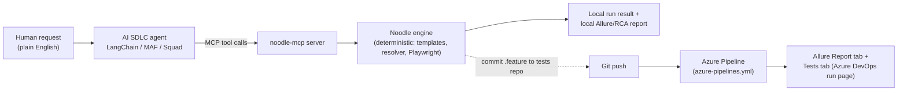
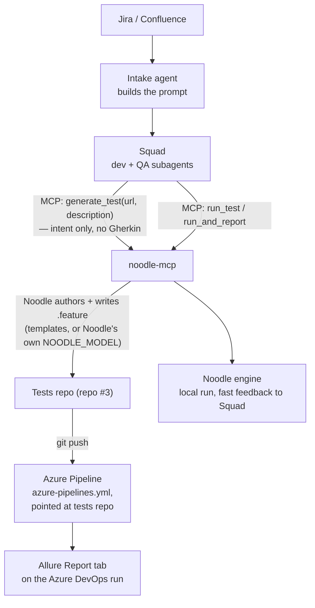

# AI SDLC Integration — Wiring Noodle into an Agent Pipeline
<!-- Branch: NOOD_0066 -->

> **For:** Azure DevOps admins and AI-SDLC integrators — humans setting up the pipeline, not the agent driving it.

How to stand Noodle up in Azure DevOps so (a) other teams can run their own
tests through it, and (b) an AI SDLC agent (LangChain, Microsoft Agent
Framework/MAF, or a multi-agent "Squad" of dev + QA subagents) can generate
a test, run it, and land the result on the Azure DevOps **Allure Report**
tab. Nothing here is new engineering — it wires together pieces that
already exist: `azure-pipelines.yml` (CI), `noodle-mcp` (the AI SDLC door,
see [mcp-guide.md](mcp-guide.md) for the full tool reference), and the
existing Allure/RCA reporting (deep CI reference:
[encyclopedia.md § CI / Azure DevOps](encyclopedia.md#11-ci--azure-devops)).

---

## Contents

1. [The picture, in plain words](#1-the-picture-in-plain-words)
2. [One-time Azure DevOps setup (org/project admin)](#2-one-time-azure-devops-setup-orgproject-admin)
3. [Letting another team bring their own tests](#3-letting-another-team-bring-their-own-tests)
4. [Hooking up an AI SDLC agent](#4-hooking-up-an-ai-sdlc-agent)
5. [The full loop: generate → run → Allure tab](#5-the-full-loop-generate--run--allure-tab)
6. [Worked example: a multi-agent "Squad" pattern](#6-worked-example-a-multi-agent-squad-pattern)
7. [Checklist](#7-checklist)

---

## 1. The picture, in plain words

Think of it like a restaurant:

- **The recipe book** = a tests repo (`.feature` files — plain English
  sentences describing a test). Every team can have its own recipe book.
- **The kitchen** = Noodle itself, plus the Azure DevOps pipeline that
  runs it. It follows recipes exactly, cooks (drives a real browser), and
  plates the result as a report.
- **The waiter** = your AI SDLC agent — LangChain, MAF, a Squad of
  subagents, or a human typing. It listens to a request ("I want a test
  that searches for X"), writes it down in the recipe book's language, and
  tells the kitchen to cook it.
- **The order pad the waiter and kitchen both understand** = the **MCP
  server** (`noodle-mcp`). It doesn't care which agent framework is
  calling — it exposes the same handful of tools (`generate_test`,
  `run_test`, `get_rca`, …) to whoever connects.



**Why MCP tool-calling and not an in-house autonomous agent?** Settled
deliberately (NOOD_0056 — see [design-history.md](design-history.md) Phase Y):
`noodle-mcp` lets any agent framework bring its own model choice, reasoning,
and cost tradeoffs while Noodle stays a deterministic, auditable executor.
Determinism is the product — a test framework whose agent "keeps trying
things until the test passes" is a flaky-test generator. So the reasoning
loop lives in the *caller* (your LangChain/MAF/Squad agent), and every LLM
call inside Noodle itself stays single-shot and bounded.

Two report destinations exist and it matters which one you mean:

- **Local report** — `run_and_report` (an MCP tool) builds an Allure HTML
  report *on whatever machine `noodle-mcp` is running on*. Fine for the
  agent's own sanity check.
- **The Azure DevOps "Allure Report" tab** — a hosted, clickable tab on a
  pipeline *run*. That only exists because `azure-pipelines.yml` ran and
  its `report` job published it. Getting a generated test onto that tab
  means the `.feature` file has to actually go through the pipeline —
  committed to the tests repo, pipeline triggered, pipeline finishes.

Section 5 walks through that end-to-end.

## 2. One-time Azure DevOps setup (org/project admin)

Do this once per Azure DevOps organization/project. After this, every team
just uses it.

1. **Install the Allure Report extension**, once, at the **organization**
   level (not per-project): Azure DevOps → Organization Settings →
   Extensions → Browse Marketplace → search `Allure Report`
   (`qameta.allure-azure-pipelines`) → Get it free. Without this, tests
   still run and publish artifacts, but there's no hosted "Allure Report"
   tab on the run page — just a downloadable zip.

2. **Import/mirror this repo** into Azure Repos, or point Azure Pipelines
   at the existing GitHub repo (Project Settings → GitHub connections, or
   just create the pipeline from GitHub directly — Azure Pipelines
   supports GitHub as a source natively, no import needed).

3. **Create the secrets variable group.** Pipelines → Library → `+
   Variable group` → name it exactly `noodle-secrets` (the YAML already
   references this name). Add whatever the tests need — at minimum
   `BASE_URL`; add `MY_EMAIL`, `MY_CARD`, `NOODLE_LLM_URL`, `NOODLE_MODEL`
   as needed. Mark real secrets (passwords, API keys) with the padlock
   icon so they're masked in logs.

   *(Optional, more secure: skip putting secrets directly in the variable
   group and instead set `NOODLE_KEYVAULT_URL` and grant the pipeline's
   service connection `get`+`list` on an Azure Key Vault — see
   [encyclopedia.md § Secrets via Key Vault](encyclopedia.md#secrets-via-key-vault).)*

4. **Create the pipeline.** Pipelines → New pipeline → pick the repo →
   "Existing Azure Pipelines YAML file" → `/azure-pipelines.yml` (Linux;
   there's also `azure-pipelines-windows.yml` for a Windows agent pool if
   you need one). Save.

5. **Run it once manually** ("Run pipeline", defaults are fine — it runs
   this repo's own bundled `sample_feature_tests/`) to confirm: Tests tab populates,
   Artifacts has `TestArtifacts-*`, and an **Allure Report** tab appears on
   the run.

That's the whole one-time setup. Nothing below requires touching this
again unless credentials rotate.

## 3. Letting another team bring their own tests

A team doesn't need to fork or modify this engine repo. They need their
**own small repo** shaped like what `noodle init` scaffolds:

```bash
# the other team runs this once, in their own new/empty repo
noodle init .
```

That gives them `noodle.yaml`, a `noodle_tests/` folder, `.env`, `resources/` —
nothing engine-specific. They write `.feature` files there, same plain
English as everywhere else in this framework.

To run their repo through *this* pipeline without copying YAML, queue this
repo's pipeline with the external-repo parameters (Run pipeline → the
parameters panel):

| Parameter | Set it to |
|---|---|
| `useExternalTestsRepo` | `true` |
| `testsRepoType` | `git` (Azure Repos) or `github` |
| `testsRepoName` | their repo, e.g. `TeamB/noodle_tests` |
| `testsRepoRef` | `refs/heads/main` |
| `testsRepoGithubEndpoint` | (only if `testsRepoType=github`) a GitHub service connection name |
| `testsRepoDir` | usually `tests` (their `noodle.yaml`'s `tests_dir`) |

The pipeline then checks out **both** repos — this one for the engine
code, theirs for the tests — and runs/reports exactly the same way,
producing their own Tests tab + Allure Report tab on their pipeline run.
Full parameter reference: [encyclopedia.md § Running against an external
tests repo](encyclopedia.md#running-against-an-external-tests-repo).

## 4. Hooking up an AI SDLC agent

This is the "waiter" from §1. The agent doesn't need to know anything
about Playwright, Gherkin syntax details, or Allure — it just needs to
speak MCP to `noodle-mcp`.

### 4.1 Stand up `noodle-mcp`

Two ways to run it, pick by where your agent lives: **A — stdio** (agent and
Noodle share a machine/container; the agent spawns `noodle-mcp` itself, no
server to host, no auth) or **B — streamable HTTP** (agent runs elsewhere —
Azure Container App, AKS pod, VM; host `noodle-mcp` as a small always-on
service with `NOODLE_MCP_API_KEY` in Key Vault). Install commands, launch
flags, and the security model are in
[mcp-guide.md §1 Setup](mcp-guide.md#1-setup) — that doc owns setup; the
snippets below assume it's done.

### 4.2 Wire it into LangChain

The standard bridge is `langchain-mcp-adapters` (LangChain's own MCP
integration) — it turns any MCP server's tools into ordinary LangChain
tools, no custom glue code needed.

```bash
pip install langchain-mcp-adapters langgraph langchain-openai
```

```python
import asyncio
from langchain_mcp_adapters.client import MultiServerMCPClient
from langchain_openai import AzureChatOpenAI
from langgraph.prebuilt import create_react_agent

async def main():
    # Option A (stdio, local process) — matches §4.1-A
    client = MultiServerMCPClient({
        "noodle": {
            "transport": "stdio",
            "command": "noodle-mcp",
            "args": ["--workspace", "/path/to/team-tests"],
        }
    })

    # Option B (remote, streamable HTTP) — matches §4.1-B, use instead of the above
    # client = MultiServerMCPClient({
    #     "noodle": {
    #         "transport": "streamable_http",
    #         "url": "https://noodle-mcp.internal.example.com/mcp",
    #         "headers": {"Authorization": f"Bearer {NOODLE_MCP_API_KEY}"},
    #     }
    # })

    tools = await client.get_tools()   # generate_test, run_test, get_rca, ...

    model = AzureChatOpenAI(azure_deployment="gpt-4.1", api_version="2024-08-01-preview")
    agent = create_react_agent(model, tools)

    result = await agent.ainvoke({
        "messages": [("user",
            'Generate a search test for example.com that searches for '
            '"office chair" and asserts the results page shows it, then '
            "run it and tell me the result.")]
    })
    print(result["messages"][-1].content)

asyncio.run(main())
```

That's the entire integration. `tools` already has the right names,
parameters, and descriptions pulled straight from `noodle-mcp` — the
agent's model decides when to call `generate_test` vs `run_test` vs
`get_rca` the same way it'd decide to call any other tool.

### 4.3 Swapping LangChain for MAF later

Nothing above needs to change on Noodle's side when you move from
LangChain to Microsoft Agent Framework — `noodle-mcp` doesn't know or care
which agent framework is calling it. Only §4.2 changes: swap
`langchain-mcp-adapters` + `create_react_agent` for MAF's own MCP tool
classes (`MCPStdioTool` / `MCPStreamableHTTPTool`), pointed at the exact
same `noodle-mcp` process or endpoint. Full MAF/Azure AI Foundry examples
(local and hosted) are in
[mcp-guide.md §7–8](mcp-guide.md#7-maf-integration-local-stdio).

If you host `noodle-mcp` remotely (§4.1-B) for LangChain today, that same
running server is what MAF/Foundry connects to later — no re-hosting,
just re-pointing the client.

## 5. The full loop: generate → run → Allure tab

Putting §2–§4 together, here's what actually happens end to end when
someone asks the AI SDLC agent for a new test and wants it to show up on
the Azure DevOps Allure tab:

1. **Human asks** the agent, in English, for a test.
2. **Agent calls `generate_test`** via MCP → Noodle writes a `.feature`
   file (+ POM if needed) into the workspace's `noodle_tests/` dir. Deterministic,
   no LLM needed on Noodle's side for this step.
3. **Agent sanity-checks it** by calling `run_test` then `get_last_result`
   (or `run_and_report` for a local HTML report) — this is the "taste it
   before serving" step, running wherever `noodle-mcp` runs.
4. **Agent commits and pushes** the new `.feature` file to the team's tests
   repo (plain `git add/commit/push`, or the Azure DevOps REST API if the
   agent has no local git checkout — `POST
   _apis/git/repositories/{repo}/pushes` with a PAT/service principal).
5. **Push triggers the Azure Pipeline** (§2/§3) automatically — it's
   already listening on `main`/`develop`. *(Optional: the agent can queue
   the pipeline explicitly instead of relying on the push trigger, via
   `POST _apis/pipelines/{pipelineId}/runs` — useful if the branch isn't
   one of the trigger branches, e.g. a feature branch under review.)*
6. **Pipeline runs it for real** — same shard/run/report steps as any other
   test, headless, in CI.
7. **Team opens the Azure DevOps run → Allure Report tab.** That's the
   hosted, trend-tracked report. The agent can also just report back the
   pass/fail from step 3 immediately, without waiting for CI, if the human
   just wants a quick answer.

Steps 1–3 are "the agent talking to Noodle." Steps 4–7 are "getting it
into Azure DevOps's system of record." Both matter, but they're different
loops — don't expect step 3's local report to *be* the Allure tab; the tab
is a CI artifact.

## 6. Worked example: a multi-agent "Squad" pattern

A concrete shape of §4 worth spelling out: an intake agent that turns
Jira/Confluence into a prompt, a "Squad" of dev + QA subagents that
generates code from that prompt, and Noodle as the piece that actually
writes, runs, and reports on the test. Squad lives in its own repo;
Noodle lives in this one.

| Piece | Restaurant role | What it actually is |
|---|---|---|
| Jira/Confluence intake agent | takes the order | builds the prompt |
| Squad (dev + QA subagents) | the waiter | writes the **application** code; asks the kitchen for a test, doesn't cook it |
| Noodle | the kitchen | writes **and** runs the test — it already owns the step vocabulary, POM resolution, and pattern knowledge |

**Who authors the Gherkin — the part to get right.** `noodle-mcp` exposes
two ways to put a `.feature` file into the workspace, and only one belongs
in this pattern:

| Tool | Who authors the Gherkin | Use it here? |
|---|---|---|
| `generate_test(url, description)` | **Noodle** — rule-based templates by default, or Noodle's own `NOODLE_MODEL` if `use_llm=True`. Squad sends only a URL and a plain-English sentence. | **Yes** — this is the whole point |
| `write_feature(path, content)` | **The caller** — content is Gherkin the calling agent already wrote itself; Noodle just validates and stores it | **No** — that's Squad's QA subagent writing the test, exactly what this pattern avoids |

Squad's QA subagent's job is to turn "I need a test that does X" into a
`generate_test` call with a good `description` string — nothing more. It
never sees or writes a line of Gherkin, because it doesn't know the step
dictionary or POM resolution order; only Noodle does.

**Where test cases live — three repos, not two.** Not in Squad's repo
(code-gen logic shouldn't fill up with `.feature` files), not in Noodle's
engine repo either (generic — shouldn't fill up with one team's tests). A
dedicated **tests repo**, scaffolded once with `noodle init .`, grows over
time as Squad generates more tests, independent of both. This is exactly
the `useExternalTestsRepo` shape from §3.



Two different "run it" moments happen, and it matters which one you mean:
Squad's own sanity check (`run_and_report` via MCP, local) vs. the
official record (the same `.feature` pushed to the tests repo, run by the
Azure Pipeline, landing on the hosted Allure Report tab — that's the one
that counts as CI).

**Azure resources needed, as the admin:** everything in §2–3 (tests repo,
pipeline, `noodle-secrets` variable group, Allure extension), plus one
thing specific to Squad calling `noodle-mcp` remotely instead of running
it locally: a place for `noodle-mcp` to live and listen (§4.1-B — Azure
Container App or AKS pod, `--transport streamable-http`) and an API key
for that endpoint (Key Vault, sent as a bearer token — never in Squad's
prompt/config in plaintext).

**Gotcha: pushing to the tests repo doesn't auto-trigger the pipeline.**
`azure-pipelines.yml`'s `trigger:` block only watches **this** repo (the
engine), not an external tests repo declared via `resources.repositories`.
A push to the tests repo does **not** auto-trigger the pipeline the way
pushing to this repo does — Squad's agent needs to explicitly queue the
run after pushing, via `POST _apis/pipelines/{pipelineId}/runs` with the
`useExternalTestsRepo`/`testsRepoName`/`testsRepoDir` parameters set in
the request body (same call as §5 step 5). Worth calling out because it's
the first thing that looks broken ("I pushed, nothing happened") if you
don't know it's expected.

## 7. Checklist

**Org/project admin, once:**
- [ ] Allure Report marketplace extension installed at org level
- [ ] Engine repo available to Azure Pipelines (Azure Repos or GitHub connection)
- [ ] `noodle-secrets` variable group created with required variables
- [ ] Pipeline created from `azure-pipelines.yml`, run once manually to confirm Tests tab + Allure Report tab
- [ ] (If hosting `noodle-mcp` remotely) container/VM stood up, `NOODLE_MCP_API_KEY` in Key Vault

**Per team bringing their own tests:**
- [ ] `noodle init .` in their own repo
- [ ] `useExternalTestsRepo`/`testsRepoType`/`testsRepoName`/`testsRepoRef`/`testsRepoDir` parameters queued on this repo's pipeline

**Per AI SDLC agent integration:**
- [ ] `noodle-mcp` reachable (stdio or streamable-http) from the agent
- [ ] Agent wired to the MCP tools (LangChain adapter, MAF tool classes, or Foundry MCP tool)
- [ ] Agent's push/queue step confirmed to actually trigger the pipeline (see §6 gotcha if using an external tests repo)
