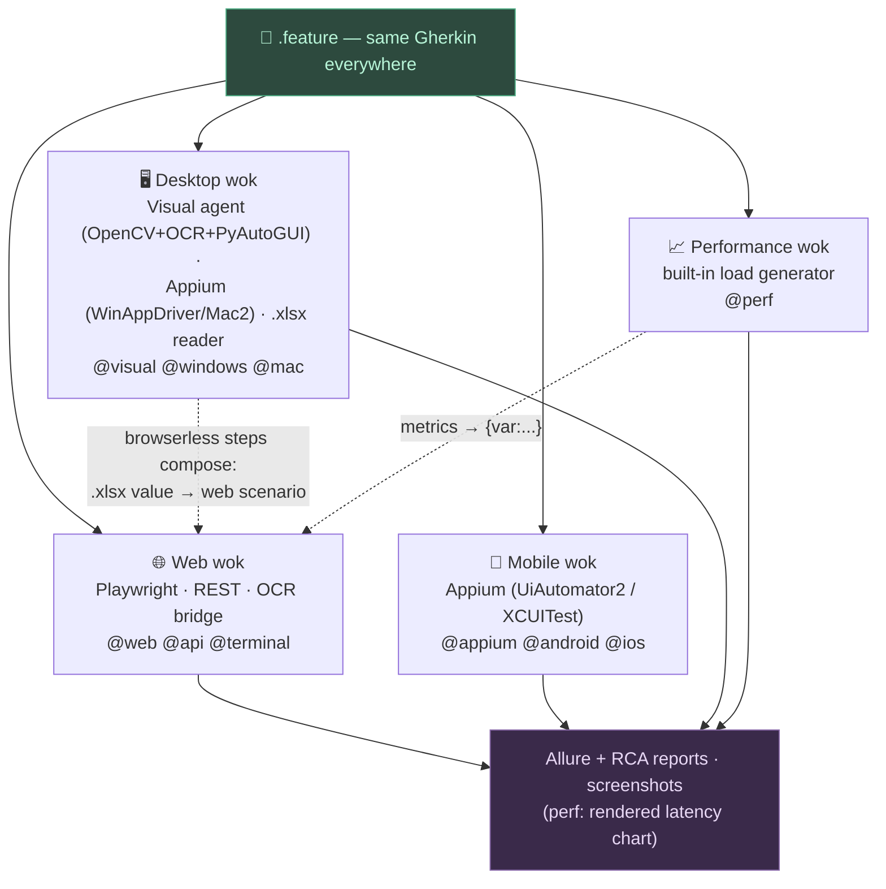
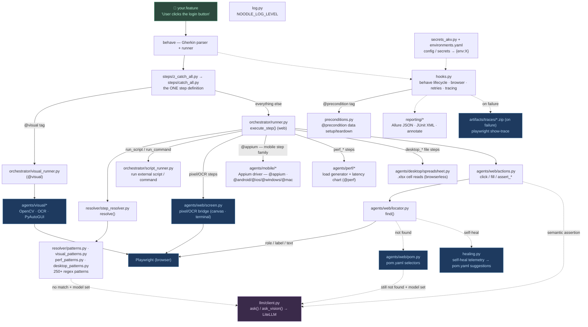
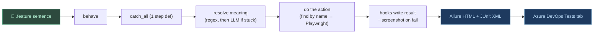
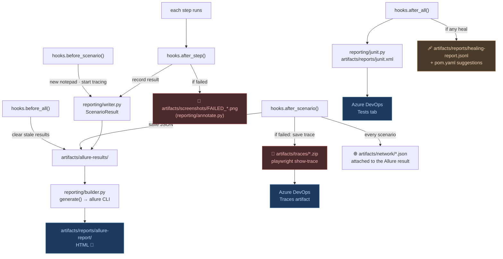

# Noodle Test Framework — The Tech, End to End
<!-- Branch: NOOD_0150 -->

> **For:** developers and maintainers — the deep technical reference, not a setup guide.

The one-stop reference for *how Noodle Test Framework actually works*. Read this the way you'd
study Selenium, Selenide, or Appium: the mental model first, then the request
lifecycle, the resolution hierarchy, the LLM layer, and the tech stack. Every
moving part is a real file in `noodle/`.

New here? Start with the **[Encyclopedia](encyclopedia.md)** (install → write → run). This page
is the deep dive behind it.

---

## Table of contents

1. [Mental model — vs Selenium / Selenide / Appium](#1-mental-model)
2. [The component map](#2-the-component-map)
3. [A step's lifecycle, start to finish](#3-a-steps-lifecycle)
4. [The resolution hierarchy — who handles each step](#4-the-resolution-hierarchy)
5. [The LLM layer — model, triggers, the client](#5-the-llm-layer)
6. [Where the report comes from](#6-where-the-report-comes-from)
7. [The tech stack — every library and why](#7-the-tech-stack)
8. [Design principles](#8-design-principles)

---

## 1. Mental model

You already know the tools Noodle Test Framework is reacting to. Here's the one-line diff.

| Tool | What *you* write | Locators |
|------|------------------|----------|
| **Selenium** | WebDriver code + step glue + Page Objects | `By.id("login-btn")` — by hand |
| **Selenide** | Concise fluent code + smart waits | `$("#login-btn")` — by hand, still in code |
| **Appium** | Selenium protocol for mobile + code | accessibility id / xpath — by hand |
| **Noodle Test Framework** | **one plain-English sentence** | none — found by role / label / text |

In Selenium-family tools you hand-write three layers: the test, the glue, and the
locator. Noodle Test Framework keeps only the sentence and infers the rest.

```java
// SELENIUM POM — you write ALL of this
@When("user clicks the login button")
public void clickLogin() { loginPage.clickLogin(); }       // 1) glue

public class LoginPage {
    private By loginBtn = By.id("login-button");            // 3) locator
    public void clickLogin() { driver.findElement(loginBtn).click(); }  // 2) page object
}
```

```gherkin
# NOODLE — you write ONLY this. No glue, no Page Object, no By.id.
When User clicks the login button
```



```mermaid
flowchart TB
    subgraph SEL["SELENIUM / SELENIDE / APPIUM — you write 3 things"]
        S1["Feature / test"] --> S2["Step definition<br/>(you write)"]
        S2 --> S3["Page Object / locator code<br/>(you write)"]
        S3 --> S4["By.id locator<br/>(you write)"]
        S4 --> S5["WebDriver acts"]
    end

    subgraph BDD["NOODLE — you write 1 thing"]
        B1["Feature sentence<br/>(you write)"] --> B2["catch-all step<br/>(built-in)"]
        B2 --> B3["resolver picks the action<br/>(built-in)"]
        B3 --> B4["locator finds it by role/label/text<br/>(built-in)"]
        B4 --> B5["Playwright acts"]
    end

    style S2 fill:#4a2a2a,color:#f5b8b8,stroke:#aa4a4a
    style S3 fill:#4a2a2a,color:#f5b8b8,stroke:#aa4a4a
    style S4 fill:#4a2a2a,color:#f5b8b8,stroke:#aa4a4a
    style B1 fill:#2d4a3e,color:#b8f5d8,stroke:#4aaa80
    style B2 fill:#3a3a3a,color:#d0d0d0,stroke:#666
    style B3 fill:#3a3a3a,color:#d0d0d0,stroke:#666
    style B4 fill:#3a3a3a,color:#d0d0d0,stroke:#666
```

Red = what you hand-write elsewhere and **don't** here. `pom.yaml` is the optional
cousin of `By.id` — you add it only for elements with no readable name (icon-only
buttons, legacy apps). See the **[Encyclopedia → POM YAML](encyclopedia.md#5-pomyaml--when-natural-naming-fails)**.

> **The whole framework is local and deterministic by default.** With no
> `NOODLE_MODEL` set there is no LLM: it's pattern matching + Playwright
> accessibility + POM + OpenCV. Anything those can't resolve **fails loudly with
> a screenshot** — it does not silently call a model. The LLM is opt-in and only
> ever a *fallback* (see [§5](#5-the-llm-layer)).

---

## 2. The component map

### The woks — capability work areas (NOOD_0155)

Everything below is organized by **wok** — Noodle's formal capability
domains (the name is a pun on "WOrK area"; full concept doc:
[woks.md](woks.md)). A wok is a self-contained area Noodle can test in, with
its own engines, step vocabulary, optional deps, samples and per-wok unit
tests (`unit_tests/woks/<wok>/`) — while all four share one Gherkin dialect,
one screenshot pipeline, and one Allure + RCA reporting stack. The registry
is code: `noodle/wok.py` (`noodle wok` lists them).



Routing is tag-driven per scenario (`hooks.before_scenario` +
`steps/catch_all.py`; the registry's `wok_for_tags()` mirrors it and
`unit_tests/woks/test_wok_registry.py` keeps the two honest). Browserless
step families (REST, spreadsheet reads, load tests) additionally dispatch
per *step*, which is what lets woks compose inside one scenario.

### The module boxes

Each box below is a real module. This is the whole framework on one page —
the *why it's shaped this way* view. For the literal package-by-package
inventory (every module's contract in table form), see
[codebase-spec.md](codebase-spec.md).



| Layer | Module(s) | Job |
|-------|-----------|-----|
| **Parse** | `behave` | Read the `.feature` file into Feature → Scenario → Step. Noodle Test Framework uses behave's parser **and** its runner. |
| **Wire** | `noodle/steps/catch_all.py` (+ `sample_feature_tests/steps/z_catch_all.py`) | One catch-all step definition receives *every* sentence. No per-step glue. (A workspace *can* still add its own `steps/*.py` defs — behave loads them before the `z_`-prefixed shim, so they win.) |
| **Route** | `noodle/hooks.py` + `steps/catch_all.py` | `hooks.py` reads scenario tags → the wok's session: Playwright browser (web), browserless (`@api`/`@perf`), or an Appium session (`@appium`/platform tags); the `@visual` → desktop-agent dispatch itself happens in `catch_all.py`. The registry mirror of this routing lives in `noodle/wok.py`. |
| **Interpret** | `noodle/resolver/` | Turn a sentence into a structured action via regex. Tag-aware (NOOD_0155): the scenario's wok table gets first claim on the sentence (`@perf` → perf table first), web-first best guess with no tags — `wok.pattern_priority`, same order at runtime, in `noodle validate`, and in the LSP. LLM fallback only if no pattern matches. |
| **Act (web)** | `noodle/agents/web/` | `actions.py` (do it) → `locator.py` (find it, accessibility-first) → `pom.py` (named selectors). |
| **Act (mobile)** | `noodle/agents/mobile/` | Appium session + gestures for `@appium`/`@android`/`@ios` (and native `@windows`/`@mac` apps, which belong to the desktop wok). |
| **Act (perf)** | `noodle/agents/perf/` | `loadgen.py` — stdlib threaded HTTP load generator with p50–p99/error/throughput metrics; `chart.py` — the wok's "screenshot": a rendered latency PNG through the evidence pipeline. |
| **Act (desktop files)** | `noodle/agents/desktop/` | `spreadsheet.py` — stdlib `.xlsx` cell reads, browserless, composable into any scenario (the Excel-value-into-a-web-test flow). |
| **Pixel/OCR bridge** | `noodle/agents/web/screen.py` | Canvas and terminal UIs with no semantic DOM: OCR-locates text in a Playwright screenshot (device-pixel coords converted to CSS-pixel mouse coords), then drives `page.mouse` / `page.keyboard`. Activated by the `focuses on`, `type_text`, `click_at`, `assert screen text` step family. |
| **Test data / scripts** | `noodle/orchestrator/script_runner.py`, `agents/web/actions.py` | Non-UI steps: run an external script/command (`run the script …`), call an API, mock a route, load a fixture. |
| **Preconditions** | `noodle/preconditions.py` | `@precondition:NAME` → seed data before a scenario and tear it down after (even on failure), from a per-folder `preconditions.yaml`. |
| **Act (visual)** | `noodle/agents/visual/` | OpenCV template match + Tesseract OCR + PyAutoGUI for non-DOM UIs. |
| **LLM** | `noodle/llm/client.py` | The single gateway to any model via LiteLLM. Reached only as a leaf-level fallback. |
| **Report** | `noodle/reporting/` | Allure JSON per step, JUnit XML for Azure, annotated failure screenshots. |
| **Trace** | `noodle/hooks.py` (Playwright tracing) | A `trace.zip` per **failed** scenario (DOM/network/timeline); discarded on pass. |
| **Heal telemetry** | `noodle/healing.py` | Records every self-heal / POM-disambiguation / vision-locate → `artifacts/reports/healing-report.jsonl` + `pom.yaml` suggestions. |
| **Agentic RCA** | `noodle/rca.py` | On a step **failure** (opt-in `NOODLE_RCA` + `NOODLE_MODEL`), a vision model classifies the root cause → `rca_category` label on the Allure result. The heuristic `rca-report` (`rca.md` + `rca.html`) is written to `artifacts/reports/` on **every** run — a green run renders the "no failures" page. |
| **Network capture** | `noodle/hooks.py` (`_wire_capture_listeners`) | Per-scenario console/page errors, failed requests, requests, websocket frames — dumped to `artifacts/network/<scenario>.json` for **every** web scenario (pass or fail) and attached to that scenario's Allure result. |
| **Secrets/config** | `noodle/secrets_akv.py`, `environments.yaml` | Base URLs + secrets (Azure Key Vault or `secrets.env`) resolved into `{env:X}` refs. |
| **Log** | `noodle/log.py` | One logger, `NOODLE_LOG_LEVEL`, mirrored to `artifacts/logs/noodle.log` for the run (the framework's own "sys log"). |
| **Drive** | `noodle/cli.py` | The `noodle` command — authoring (`init`, `init-mcp`, `author`, `probe`, `probe-app`, `inspect`, `record`, `repl`, `steps`, `step-search`), running (`run`, `validate`, `list`, `doctor`, `cost`), and reporting (`report …`, `rca-report`, `summary`, `artifacts`, `clean`, `archive`, `diagnostic …`) + retry/quarantine exit code. Full list: [cli-reference.md](cli-reference.md). |
| **Edit** | `noodle/lsp/` + `vscode-extension/` | LSP step validation, tag/variable autocomplete, syntax highlighting. |

---

## 3. A step's lifecycle

The actual path for a normal `@web` step, in plain words:

1. Your `.feature` sentence reaches **behave**, which hands **every** step to the one
   built-in `catch_all()`.
2. `catch_all` checks the tag: `@visual` → the desktop agent; otherwise → `execute_step()`.
3. `execute_step` **substitutes variables** (`{env:SAUCE_USERNAME}` → env value, `{var:captured}` → run store), then asks the **resolver**: *what does this sentence mean?*
4. The resolver tries 250+ regex patterns. Match → it returns an action dict (`click`, `fill`, `assert_visible`, …). No match → it calls the LLM **only if a model is configured** (Trigger 1).
5. The action runs through `actions.py`, which uses `locator.py` to **find the element by its readable name** — role / label / placeholder / text. No `By.id` needed.
6. Element not found? Try `pom.yaml`. Still not found? Vision LLM (Trigger 2) — again, only if a model is set.
7. Playwright performs the actual click/fill in the browser.
8. `hooks.py` records the result; on failure it snaps an annotated screenshot.



**One sentence to remember:** you write the *what* (a plain sentence); Noodle Test Framework
figures out the *how* (regex → find by name → POM → LLM only if stuck) and hands
you a screenshot-filled report.

---

## 4. The resolution hierarchy

This is the single source of truth for **when local logic runs vs when an LLM
takes over**. A step passes through up to four levels; at each one the **local**
path is tried first, and the **LLM** path is a labelled fallback that fires only
under the stated condition (and only if the env var is set — otherwise the step
fails).

```mermaid
flowchart TD
    S["Gherkin step"] --> L0

    subgraph L0["① Interpret the sentence — resolver"]
        P["Pattern match (250+ regex)\nLOCAL · no cost"] -->|matched| OUT0["action"]
        P -->|no match| LLM0["LLM step fallback\nonly if NOODLE_MODEL set\nelse: step FAILS"]
        LLM0 --> OUT0
    end

    OUT0 --> L1{"② Route by tag"}
    L1 -->|@visual| VIS
    L1 -->|web default| WEB

    subgraph WEB["③ Web — find the element (locator.find)"]
        EXP{"text written\nas {pom:key}?"} -->|yes| POME["POM YAML ONLY\nLOCAL · not found → FAILS\n(never reaches steps below)"]
        POME --> HIT
        EXP -->|no| P0["POM YAML\npage-scoped → shared → flat\nLOCAL · explicit beats heuristic"] -->|found| HIT["use it"]
        P0 -->|no entry| A["Accessibility tree (smart-wait poll)\nrole / label / placeholder / text\nLOCAL"] -->|exactly 1| HIT
        A -->|2+ matches| VF["exactly 1 VISIBLE?\nLOCAL → yes: use it"]
        VF -->|still 2+| AMB["POM scoped entry?\nLOCAL → yes: use it"]
        AMB -->|no entry| MODE["strict: FAIL · lenient: first visible + warn"]
        A -->|0| HEAL["self-heal chain, LOCAL:\nscroll → POM retry → partial word\n→ auth-verb synonyms → DOM attribute scan"]
        HEAL -->|found| HIT
        HEAL -->|still 0| VL["Vision LLM locate\nonly if NOODLE_MODEL set"]
        VL -->|found| HIT
        VL -->|not found| OCR["OCR coordinate fallback\nonly if @ocr_fallback set\nelse: step FAILS"]
        OCR --> HIT
    end

    subgraph VIS["③ Visual — find on screen"]
        T["OpenCV template match (image steps)\nOCR (text steps)\nLOCAL"] -->|found| HIT2["use coords"]
        T -->|not found| VL2["Vision LLM locate\nonly if NOODLE_VISION_MODEL\nor NOODLE_MODEL set\nelse: step FAILS"]
        VL2 --> HIT2
    end

    HIT --> L3
    HIT2 --> L3

    subgraph L3["④ Assertions"]
        ST["Structural: text / url / title\nLOCAL"]
        SE["Semantic / visual-baseline\nALWAYS vision LLM — requires NOODLE_MODEL"]
    end

    style P fill:#1e3a5f,color:#b8d8f5,stroke:#4a80aa
    style A fill:#1e3a5f,color:#b8d8f5,stroke:#4a80aa
    style POM fill:#1e3a5f,color:#b8d8f5,stroke:#4a80aa
    style T fill:#1e3a5f,color:#b8d8f5,stroke:#4a80aa
    style ST fill:#1e3a5f,color:#b8d8f5,stroke:#4a80aa
    style LLM0 fill:#4a3a2a,color:#f5d8b8,stroke:#aa804a,stroke-dasharray:4 4
    style VL fill:#4a3a2a,color:#f5d8b8,stroke:#aa804a,stroke-dasharray:4 4
    style VL2 fill:#4a3a2a,color:#f5d8b8,stroke:#aa804a,stroke-dasharray:4 4
    style SE fill:#4a3a2a,color:#f5d8b8,stroke:#aa804a,stroke-dasharray:4 4
```

**Level ① — interpret the sentence** (`resolver/step_resolver.py`). Pattern match
covers most steps for free. The LLM is asked for a JSON action only when every
regex misses **and** `NOODLE_MODEL` is set; otherwise the step fails.

**Level ② — route by tag** (`steps/catch_all.py`). `@visual` → desktop/OpenCV
agent; everything else → web/Playwright. Local and free.

**Level ③ (web) — find the element** (`agents/web/locator.py`), in order:
0. **`{pom:key}` explicit** — a step author pinned the name (`the {pom:burger menu}`). Goes straight to POM YAML and nowhere else; not found there → the step **fails immediately**, naming the file chain it checked. Steps 1-5 never run.
1. **POM YAML** — page-scoped block → `shared:` → flat keys. Checked *before* the accessibility scan (explicit beats heuristic, NOOD_0008): an author-written selector must not be shadowed by a unique-but-wrong text match. Skipped for row/section/iframe-scoped lookups (POM selectors are page-global).
2. **Accessibility tree** — role, label, placeholder, title, text, polled under the smart-wait budget (`NOODLE_FIND_TIMEOUT`, early-exit once the page is settled — network quiet + DOM stable, NOOD_0103). A *unique* match is used immediately; fill/clear steps try editable-constrained strategies first (`prefer="input"`, NOOD_0089).
3. **Ambiguous** (2+ matches) → narrow to *visible* matches — exactly one visible wins (hidden mobile/desktop duplicate markup, NOOD_0106); still ambiguous → consult **POM** for a scoped selector. No entry → strict mode **fails** with the candidate list; lenient (default) warns and uses the first *visible* match.
4. **Self-heal chain** (all local) — scroll and retry → POM retry → first-word partial match → auth-verb synonyms (login ↔ sign in / log in…, NOOD_0109) → DOM attribute scan (id / data-\* / aria / automation-prefixed class tokens, hidden elements included, NOOD_0089/0109).
5. **Vision LLM locate** — screenshot → "give me a CSS selector". Only if `NOODLE_MODEL` is set.
6. **OCR coordinate fallback** — opt-in (`@ocr_fallback` / `NOODLE_OCR_FALLBACK`); the only route into a *closed* shadow root.

**Level ③ (visual) — find on screen** (`orchestrator/visual_runner.py`): OpenCV
template match for image steps (OCR handles the separate text-step family), then
vision-LLM-locate-by-description if `NOODLE_VISION_MODEL` **or** `NOODLE_MODEL`
is set. `NOODLE_VISION_MODEL` is an enable flag only — the actual model string
sent is always `NOODLE_MODEL` (`llm/client.py`), so set both for a
desktop-only-LLM setup.

**Level ④ — assertions**: structural checks (`should see`, `url containing`,
`page title`) are direct DOM/text — never an LLM. Semantic / visual-baseline
assertions (`the X should show…`, `the screen should look the same as before`)
are **always** a vision LLM call and require `NOODLE_MODEL`.

### "What runs for this step?"

| Step | Resolves via |
|------|--------------|
| `User clicks the login button` (button reads "Login") | Local — accessibility |
| `User clicks the burger menu` (icon-only) | Local — POM YAML |
| `User clicks "Add to cart"` (six on page) | Local — POM if scoped; else first-match (lenient) or FAIL (strict) |
| `User should see "Products"` | Local — DOM text |
| `` `total` should be greater than "0" `` | Local — comparison assertion |
| `User enters X in the obscure_widget` (no label, no POM, model set) | LLM — vision locate |
| `User finalizes the login form` (verb not in patterns, model set) | LLM — step fallback |
| `the dashboard should show a healthy state` | LLM — semantic assertion (required) |
| `I click image "save.png"` (`@visual`) | Local — OpenCV template match |

### Strict mode — fail instead of guess

By default ambiguity is lenient (warn + first match) so suites stay green. For CI
you usually want it to **fail** so wrong-element bugs surface:

```bash
NOODLE_STRICT_LOCATOR=true      # whole run
```
```gherkin
@strict
Scenario: ...                      # this scenario only
```

---

## 5. The LLM layer

What model is used, what triggers it, and the one module that handles it.

### Model-agnostic by design

Noodle Test Framework talks to whatever **[LiteLLM](https://github.com/BerriAI/litellm)**
supports, through one provider/model string. There is no hard-coded vendor — you
pick the model in `.env`.

| Setting | Env var | Notes |
|---------|---------|-------|
| Model id (LiteLLM format) | `NOODLE_MODEL` | e.g. `anthropic/claude-sonnet-5` (recommended), `openai/gpt-4o-mini`, `ollama/llama3` (local fallback). **Unset by default → no LLM.** |
| API base URL | `NOODLE_LLM_URL` | e.g. `http://localhost:11434` (Ollama) or `https://api.openai.com/v1`. Not required for Anthropic/Gemini/Groq. |
| Desktop/visual fallback flag | `NOODLE_VISION_MODEL` | enable flag for the `@visual` image fallback only (`NOODLE_MODEL` also enables it). The model string actually called is always `NOODLE_MODEL`. |
| Resolution mode | `NOODLE_LLM_MODE` | `auto` (default) — patterns first, LLM on no-match; `full` — LLM resolves every step, patterns skipped. Requires `NOODLE_MODEL`. |

Features that send a screenshot (vision-locate, semantic assertions) need a
**vision-capable** model (`anthropic/claude-sonnet-5`, `ollama/llava`, `openai/gpt-4o-mini`,
`gemini/gemini-1.5-flash`, …). Because LiteLLM speaks OpenAI-compatible endpoints,
the same config drives Ollama, hosted OpenAI, Anthropic Claude, Google Gemini, Groq,
**or [Foundry Local](https://learn.microsoft.com/azure/foundry-local/)** (a local
model runtime that works on networks where Ollama/Hugging Face are blocked) with
**zero code changes** — see [Design History → Phase 10](design-history.md#phase-10--foundry-local).

Install the dependency (LiteLLM is the only LLM dep):

```bash
uv pip install -e ".[llm]"     # or: pip install -e ".[llm]"
```

### The client module

One thin module — **`noodle/llm/client.py`** — two functions, no class hierarchy:

| Function | Purpose | Reads |
|----------|---------|-------|
| `ask(prompt) -> str` | text completion (step interpretation) | `NOODLE_MODEL`, `NOODLE_LLM_URL` |
| `ask_vision(prompt, image_b64) -> str` | text + screenshot (locate / assert) | `NOODLE_MODEL`, `NOODLE_LLM_URL` |

`litellm` is imported lazily, so the framework imports and runs with **no LLM
extra installed** — you only hit the import error if you actually trigger an LLM
path without `".[llm]"`. Everything else *calls* this module; nothing else talks
to a model directly.

### The four triggers (`auto` mode)

Each is a local layer failing **plus** the matching env var being set. If the var
is unset, the step fails locally instead — the LLM is never called.

| # | Trigger (local layer missed) | Caller | Function | Gate |
|---|------------------------------|--------|----------|------|
| 1 | No regex pattern matched the sentence | `resolver/step_resolver.py` | `ask` | `NOODLE_MODEL` |
| 2 | Web element not found by accessibility + POM | `agents/web/locator.py` | `ask_vision` | `NOODLE_MODEL` |
| 3 | Semantic / visual-baseline assertion | `agents/web/actions.py` | `ask_vision` | `NOODLE_MODEL` |
| 4 | `@visual` image not found by OpenCV | `agents/visual/vision_locate.py` | `ask_vision` | `NOODLE_VISION_MODEL` **or** `NOODLE_MODEL` |

Note the split: triggers 1–3 (web path) gate on `NOODLE_MODEL`; trigger 4
(desktop path) fires when *either* var is set — `NOODLE_VISION_MODEL` exists so
a desktop suite can enable the fallback without also enabling the web triggers,
but the model actually called is always `NOODLE_MODEL`.

These four are the **runtime step-execution** fallbacks — the ones that can fire
mid-run. Other opt-in surfaces also route through `client.py` (nothing talks to
a model except through it): generation-time authoring (`generate --llm`, REPL
`--llm`, step-search tie-break), reporting narratives (`summary --llm`,
RCA prose + fix suggestions in `rca_report.py`), and the `NOODLE_RCA` failure
classifier (`rca.py`, its own `NOODLE_RCA_MAX_CALLS` spend pool).

### Full LLM mode (`NOODLE_LLM_MODE=full`)

Setting `NOODLE_LLM_MODE=full` promotes the LLM from fallback to **primary**
resolver for both step interpretation and element location. Patterns are not
consulted. `NOODLE_MODEL` must be set and vision-capable for the locator path.

```mermaid
flowchart TD
    STEP["Gherkin step"] --> MODE{"NOODLE_LLM_MODE"}

    MODE -->|auto default| RES["Resolver: 250+ regex patterns<br/>LOCAL"]
    RES -->|matched| ROUTE{"route by tag"}
    RES -->|no match| T1F["ask() fallback<br/>NOODLE_MODEL"]
    T1F --> ROUTE

    MODE -->|full| T1["ask() — primary resolver<br/>patterns skipped<br/>NOODLE_MODEL required"]
    T1 --> ROUTE

    ROUTE -->|web · auto| PW["Playwright accessibility<br/>LOCAL → POM → ask_vision()"]
    ROUTE -->|web · full| VL["ask_vision() — primary locator<br/>accessibility as safety net"]
    ROUTE -->|@visual| CV["OpenCV + OCR<br/>LOCAL"]

    T1 -.calls.-> CLIENT["llm/client.py → LiteLLM"]
    T1F -.calls.-> CLIENT
    PW -.fallback.-> CLIENT
    VL -.calls.-> CLIENT

    style RES fill:#1e3a5f,color:#b8d8f5,stroke:#4a80aa
    style PW fill:#1e3a5f,color:#b8d8f5,stroke:#4a80aa
    style CV fill:#1e3a5f,color:#b8d8f5,stroke:#4a80aa
    style T1 fill:#4a3a2a,color:#f5d8b8,stroke:#aa804a
    style T1F fill:#4a3a2a,color:#f5d8b8,stroke:#aa804a,stroke-dasharray:4 4
    style VL fill:#4a3a2a,color:#f5d8b8,stroke:#aa804a
    style CLIENT fill:#3a2a4a,color:#e8d8f5,stroke:#8a6aaa
```

**Trade-off:** `full` mode is slower (one LLM call per step) and costs money with
hosted models. Use `auto` for CI and regression suites. Use `full` for exploratory
testing, legacy app automation, or any scenario where the step vocabulary is too
rich or too inconsistent to pattern-match upfront.

**Suggestions log:** every LLM resolution (`full` mode, or the `auto`-mode
pattern-miss fallback) is appended to the workspace's
`docs/steps_dictionary_suggestions.md`, one entry per distinct step text
(timestamped, tagged with the resolving `NOODLE_MODEL`). Resolutions are never
auto-promoted into `patterns.py` — a human reviews the log and promotes
recurring steps by hand, then deletes the entry.

```mermaid
flowchart TD
    STEP["Gherkin step"] --> RES["Resolver: 250+ regex patterns<br/>LOCAL"]
    RES -->|matched| ROUTE{"route by tag"}
    RES -->|no match| T1["ask() — step fallback<br/>trigger 1 · NOODLE_MODEL"]
    T1 --> ROUTE

    ROUTE -->|web| PW["Playwright accessibility<br/>role / label / text · LOCAL"]
    ROUTE -->|@visual| CV["OpenCV template + OCR<br/>LOCAL"]

    PW -->|found| ACT["run web action"]
    PW -->|not found| POM["POM YAML · LOCAL"]
    POM -->|found| ACT
    POM -->|not found| T2["ask_vision() — vision locate<br/>trigger 2 · NOODLE_MODEL"]
    T2 --> ACT

    CV -->|found| VACT["run visual action"]
    CV -->|not found| T4["ask_vision() — locate by description<br/>trigger 4 · NOODLE_VISION_MODEL or NOODLE_MODEL"]

    ACT --> ASSERT{"assertion?"}
    ASSERT -->|structural: text/url/title| LOCALA["DOM check · LOCAL"]
    ASSERT -->|semantic / baseline| T3["ask_vision() — semantic assert<br/>trigger 3 · NOODLE_MODEL"]

    T1 -.calls.-> CLIENT["llm/client.py<br/>ask · ask_vision → LiteLLM"]
    T2 -.calls.-> CLIENT
    T3 -.calls.-> CLIENT
    T4 -.calls.-> CLIENT

    style RES fill:#1e3a5f,color:#b8d8f5,stroke:#4a80aa
    style PW fill:#1e3a5f,color:#b8d8f5,stroke:#4a80aa
    style CV fill:#1e3a5f,color:#b8d8f5,stroke:#4a80aa
    style POM fill:#1e3a5f,color:#b8d8f5,stroke:#4a80aa
    style LOCALA fill:#1e3a5f,color:#b8d8f5,stroke:#4a80aa
    style T1 fill:#4a3a2a,color:#f5d8b8,stroke:#aa804a,stroke-dasharray:4 4
    style T2 fill:#4a3a2a,color:#f5d8b8,stroke:#aa804a,stroke-dasharray:4 4
    style T3 fill:#4a3a2a,color:#f5d8b8,stroke:#aa804a,stroke-dasharray:4 4
    style T4 fill:#4a3a2a,color:#f5d8b8,stroke:#aa804a,stroke-dasharray:4 4
    style CLIENT fill:#3a2a4a,color:#e8d8f5,stroke:#8a6aaa
```

Blue = local (never costs an LLM call). Orange dashed = the four LLM fallbacks,
all funnelling into `client.py`. The LLM is always **downstream** of OpenCV and
Playwright — it only runs when the local engine on that branch came up empty and
the env var is set.

### How does Claude or Copilot know which patterns to use when developing or running the tests?

`NOODLE_LLM_MODE`/`NOODLE_MODEL` (above) govern the **engine's own**
mid-run fallback resolver — they have nothing to do with an external
agentic CLI (Claude Code, Copilot CLI) authoring or running tests via the
noodle skill/MCP. That CLI is the driver regardless of whether those env
vars are set; the engine has no channel to call back into the MCP host, so
the host agent can never be the run-time model (see
[llm-setup.md](llm-setup.md)).

Instead, the external agent discovers step vocabulary through lookup
tooling the skill points it at *before* it writes a step — never by
inventing phrasing or reading `patterns.py` directly:

| Access | Lookup |
|---|---|
| MCP tools (`noodle-mcp`) | `search_step(query)` |
| Shell/CLI | `noodle steps "<keyword>"` / `noodle step-search "<description>"` |
| Either | `docs/steps_dictionary.md` — the full pattern table |

The agent then validates the draft against the pattern table without a
browser (`validate_feature` / `noodle validate --resolve`) before running
it. A step that still doesn't match falls through to the engine's own
runtime resolver described above — which only fires if `NOODLE_MODEL`/
`NOODLE_LLM_MODE` is configured — and gets logged to
`docs/steps_dictionary_suggestions.md` for a human to promote by hand.

### The sample test that triggers the LLM

`sample_feature_tests/web/fallback-demo/features/llm_fallback.feature` exists to demonstrate **Trigger 1**.
Every step resolves locally except one:

```gherkin
@web @llm_fallback
Feature: LLM Fallback Demonstration

  Scenario: A step the regex layer can't parse is interpreted by the model

    Given User is on "https://www.saucedemo.com"             # {env:A11Y} pattern match
    When User enters {env:SAUCE_USERNAME} in the username field  # {env:A11Y} placeholder
    And User enters {env:SAUCE_PASSWORD} in the password field   # {env:A11Y} placeholder
    When User finalizes the login form                       # {env:LLM}  no pattern → model
    Then User should see "Products"                          # {env:A11Y} DOM text
```

The verb **"finalizes"** is in no regex pattern, so `step_resolver` hands the
sentence to the model, which returns an action like `{"type":"click","locator":"Login"}`.
(The demo originally used *"submits"* — then NOOD_0025 promoted `submit` into a
real pattern, which is the suggestions-log lifecycle doing its job: recurring
LLM resolutions get promoted, and the demo verb had to move on.)

Run it (needs a model — with `NOODLE_MODEL` unset, the `[LLM]` step fails by design):

```bash
# .env: NOODLE_MODEL=anthropic/claude-sonnet-5  (or an OpenAI / Gemini / Ollama / Foundry Local id)
noodle run sample_feature_tests/web/fallback-demo/features/llm_fallback.feature --headed
```

To watch the raw prompt/response exchange:

```bash
uv run --with litellm --with pytest python -m pytest unit_tests/test_llm_openai_endpoint.py -s
```

### Config recap

```bash
# ── auto mode (default) ───────────────────────────────────────────────────────
# Recommended: a Sonnet-class hosted model — vision-capable, so every trigger
# (text fallback, vision locate, semantic assertions, RCA) works from one id.

# Anthropic Claude Sonnet (recommended default) — no NOODLE_LLM_URL needed
NOODLE_MODEL=anthropic/claude-sonnet-5
ANTHROPIC_API_KEY=sk-ant-...

# OpenAI-compatible endpoints
NOODLE_MODEL=openai/gpt-4o-mini
OPENAI_API_KEY=sk-...

# Google Gemini — free tier, vision-capable
NOODLE_MODEL=gemini/gemini-1.5-flash
GEMINI_API_KEY=...

# Groq — free tier, text only (no vision)
NOODLE_MODEL=groq/llama-3.1-8b-instant
GROQ_API_KEY=...

# ── local fallback — restricted networks / zero-cost laptops ─────────────────
# Screenshots of the app under test never leave the machine. Weaker models:
# expect lower resolution quality than GPT-4o-class.
NOODLE_MODEL=ollama/llava            # vision-capable; ollama/llama3 = text only
NOODLE_LLM_URL=http://localhost:11434

# Desktop @visual image fallback — enable flag only; the call itself uses
# NOODLE_MODEL, so point NOODLE_MODEL at the vision-capable model too
NOODLE_VISION_MODEL=1
NOODLE_MODEL=anthropic/claude-sonnet-5   # or openai/gpt-4o-mini / ollama/llava

# ── full LLM mode ─────────────────────────────────────────────────────────────
# Every step resolved by the model. Patterns skipped. Requires a vision-capable
# model for element location. Slower and costs more — not recommended for CI.
NOODLE_LLM_MODE=full
NOODLE_MODEL=anthropic/claude-sonnet-5
ANTHROPIC_API_KEY=sk-ant-...
```

Leave them all unset for a deterministic, zero-cost, fully-local run — the
recommended CI baseline.

---

## 6. Where the report comes from

`hooks.py` watches every scenario via behave's lifecycle and turns the results
into an Allure report + Azure-ready JUnit XML.



- `before_all` clears stale `artifacts/allure-results/` so the report + quarantine scan reflect only this run.
- `before_scenario` starts a fresh `ScenarioResult` **and** Playwright tracing.
- After **each step**, `after_step` records the result and, **on failure**, snaps a full-page screenshot (annotated by `annotate.py` with Pillow). If `NOODLE_RCA` is on, `rca.py` then classifies the failure's root cause from that screenshot and tags the result with an `rca_category` label (best-effort, never raises).
- `after_scenario` saves the result as JSON, and writes `artifacts/network/<scenario>.json` for **every** web scenario (console/page errors, failed requests, websocket frames captured passively) — also attached to that scenario's Allure result. On failure only, it additionally writes `artifacts/traces/<scenario>.zip` (trace discarded on pass).
- `after_all` writes one `junit.xml` (Azure's Tests tab), if any locator healed the `artifacts/reports/healing-report.jsonl` + report, and — on **every** run — `artifacts/reports/rca.md` + `rca.html` (heuristic root-cause table, no model call; a green run renders the "no failures" page).
- `builder.py` shells out to the **Allure CLI** to render `artifacts/allure-results/` → `artifacts/reports/allure-report/` HTML.
- `noodle artifacts` lists every category under `artifacts/` with file counts/size; `noodle clean` deletes the tree; `noodle archive` zips it to `archives/artifacts_<timestamp>.zip` before the next run overwrites it.

Compared to Selenium: like TestNG/JUnit reports + a screenshot listener, except
it's built in and also produces Allure + Azure-ready JUnit with failure
screenshots attached automatically. See **[Encyclopedia → Reports](encyclopedia.md#8-reports)**
for the commands.

**Open question:** the framework log lives alongside the report
(`artifacts/logs/noodle.log`), not inlined into Allure attachments. No decision
has been made to change that. (Network logs *are* attached per scenario.)

---

## 7. The tech stack

Every library, the declared minimum from `pyproject.toml` (the wheel may install
newer), and why it's here.

### Language & tooling

| Tech | Version | Purpose |
|------|---------|---------|
| Python | `>=3.11` | Framework language (uses `tomllib`, modern typing). |
| **uv** | latest | Dependency manager / runner. The project ships `uv.lock`; `pip` also works. |
| Node.js + npm | extension only | Builds the VS Code extension. Not needed to run tests. |

### Core dependencies (always installed)

| Library | Min | Purpose |
|---------|-----|---------|
| [behave](https://behave.readthedocs.io/) | `1.2.6` | BDD runner — parses Gherkin and drives each step. **Synchronous**, which is why Playwright's sync API is used. |
| [playwright](https://playwright.dev/python/) | `1.40.0` | Browser automation (Web Agent). Sync API. Chromium / Firefox / WebKit. |
| [typer](https://typer.tiangolo.com/) | `0.9.0` | The `noodle` CLI. |
| [python-dotenv](https://github.com/theskumar/python-dotenv) | `1.0.0` | Loads `.env` config + credentials. |
| [pillow](https://python-pillow.org/) | `10.0.0` | Screenshot annotation **and deterministic pixel-diff baselines** (`pixel_baseline`). |
| [pyyaml](https://pyyaml.org/) | `6.0` | Parses `pom.yaml`. |

### Optional extras

| Extra | Library (min) | Purpose |
|-------|---------------|---------|
| `[llm]` | [litellm](https://github.com/BerriAI/litellm) `1.0.0` | One interface to any model; the only LLM dep. |
| `[lsp]` | [pygls](https://github.com/openlawlibrary/pygls) `1.3.0`, [lsprotocol](https://github.com/microsoft/lsprotocol) `2023.0.0` | VS Code step validation/autocomplete. |
| `[reporting]` | [allure-python-commons](https://github.com/allure-framework/allure-python) `2.16.0` | Emits Allure result JSON. |
| `[visual]` | [opencv-python](https://github.com/opencv/opencv-python) `4.8.0`, [pytesseract](https://github.com/madmaze/pytesseract) `0.3.10`, [pyautogui](https://github.com/asweigart/pyautogui) `0.9.54`, [mss](https://github.com/BoboTiG/python-mss) `9.0.1` | Template matching, OCR, desktop control, screen capture. |
| `[azure]` | [azure-identity](https://github.com/Azure/azure-sdk-for-python) `1.15.0`, [azure-keyvault-secrets](https://github.com/Azure/azure-sdk-for-python) `4.7.0` | Load secrets from Azure Key Vault (managed identity). |
| `[parallel]` | [behavex](https://github.com/hrcorval/behavex) `4.0.0` | Parallel scenario execution. |
| `[mobile]` | [Appium-Python-Client](https://github.com/appium/python-client) `3.0.0` | Native app steps (Appium). |
| `[desktop]` | [pygetwindow](https://github.com/asweigart/PyGetWindow) `0.0.9` | Desktop window management for `@visual`. |
| `[mcp]` | [mcp](https://github.com/modelcontextprotocol/python-sdk) `1.2.0` | The `noodle-mcp` server. |
| `[dev]` | pytest `7.4.0`, ruff `0.6.0` | Unit tests + lint. |
| `[all]` | all of the above **except `[llm]`** | Deliberate (NOOD_0074): a full install stays model-free; add `[llm]` explicitly to opt in. |

### External binaries (not pip/uv installed)

| Thing | Install via | Purpose |
|-------|-------------|---------|
| Playwright browsers | `playwright install chromium` | The actual browser binaries. |
| [Tesseract OCR](https://github.com/tesseract-ocr/tesseract) | `brew` / `apt` / `winget` | OCR engine `pytesseract` calls (for `@visual`). |
| [Allure CLI](https://allurereport.org/) | `brew` / scoop / npm | Renders Allure JSON → HTML. |
| [Foundry Local](https://learn.microsoft.com/azure/foundry-local/) (opt.) | `winget` / `brew` | Local OpenAI-compatible model runtime for locked-down networks. |
| Ollama (opt.) | ollama.com | Local model runtime — the zero-cost fallback for restricted networks / laptops (cloud Sonnet is the recommended default). |

### Dev / CI

| Tech | Purpose |
|------|---------|
| [pytest](https://pytest.org/) | The `unit_tests/` suite — **1,800+ tests, no browser/LLM/display needed**. `make test`. |
| Makefile | `make test`, `make lint`, `make vsix`, `make install-ext`, `make clean`. |
| Azure Pipelines | `azure-pipelines.yml` (Linux) + `azure-pipelines-windows.yml` (Windows) — **file-level matrix sharding** (one `.feature` file per agent), publish JUnit + Allure + failure traces. |
| Docker / devcontainer | `Dockerfile` (Playwright base image, browsers preinstalled) + `.devcontainer/` for reproducible CI and local parity. |

---

## 8. Design principles

1. **The `.feature` file is the only QA artifact.** No Python, no JSON config alongside it. `pom.yaml` is the one optional escape hatch.
2. **Sentences over syntax.** Steps are plain English; the resolver interprets them.
3. **Accessibility before LLM.** Elements are found by role/label/text first. The LLM is a fallback, never the default.
4. **Local and deterministic by default.** No model configured → no model calls. Unresolvable steps fail loudly with a screenshot.
5. **Evidence-first failures.** Every failure includes an annotated screenshot showing what went wrong and where.
6. **All open source.** Every dependency has a permissive licence.

For the chronological "how each capability got built" record, see
**[Design History](design-history.md)**.
</content>
