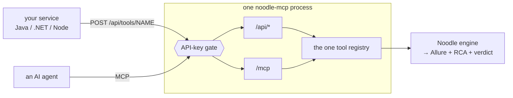

# Engine API guide — drive Noodle over plain HTTP

> **Not the api wok.** This doc is about *calling* Noodle from another system.
> If you want to **test a REST service** — write `.feature` files that GET and
> POST and assert on responses — that's the **api wok**:
> [woks.md § API](woks.md#api). Noodle both tests APIs and is callable as one;
> the vocabulary that keeps them apart is in
> [glossary.md](glossary.md#api-means-two-different-things--say-which-nood_0193).

**Who this is for:** a developer who wants to author, run and report Noodle
tests from their own service — Java, .NET, Node, a CI step, a dashboard — with
nothing but an HTTP client. No MCP, no Python, no Noodle knowledge.

**The one-line version:** start `noodle-mcp --transport streamable-http`, then
`POST /api/tools/<name>` with a JSON body. That's the whole API.

New to this? Read [§1](#1-the-mental-model) and [§2](#2-what-the-devs-do-once).
Already set up? Jump to [the cookbook](#5-the-four-things-you-came-for).

---

## Contents

1. [The mental model](#1-the-mental-model)
2. [What the devs do, once](#2-what-the-devs-do-once)
3. [Start the server](#3-start-the-server)
4. [Swagger UI and the OpenAPI spec](#4-swagger-ui-and-the-openapi-spec)
5. [The four things you came for](#5-the-four-things-you-came-for)
6. [Reading a run result](#6-reading-a-run-result)
7. [Gotchas that will bite you](#7-gotchas-that-will-bite-you)
8. [When NOT to use the API](#8-when-not-to-use-the-api)

---

## 1. The mental model

Noodle isn't a service you deploy in front of a database. It's a **test runner
that drives real browsers and real HTTP calls**, and this API is a remote
control for it. Three things follow from that, and they explain every design
choice below:

- **The server runs the tests.** Whichever machine serves `/api/*` is the
  machine launching Chromium, so it needs Noodle *and* its browsers installed.
  Your Java service is a client; it does no testing itself.
- **Calls are synchronous.** `POST /api/tools/run_and_report` returns when the
  run has finished — seconds for a browserless api-wok test, minutes for a
  browser suite.
  There is no job id and nothing to poll: the response body is the result.
- **There is no REST resource model.** No `/tests/{id}` with GET/PUT/DELETE.
  Every operation is `POST /api/tools/<name>` with that tool's arguments as the
  body. One verb, one shape, 24 operations. This is deliberate: the tool list
  is generated from the engine, so it can never drift from what Noodle can
  actually do.

Noodle already had three ways in — the CLI, and MCP over stdio or HTTP for AI
agents. `/api/*` is a **second doorway onto the same tools**, added
(NOOD_0193) for callers that can't speak MCP:



Full transport detail: [mcp-guide.md § 8.1](mcp-guide.md#81-plain-http-for-non-mcp-callers-nood_0193).

---

## 2. What the devs do, once

You have repo access, so install from the clone — that way the API you're
calling is the code you can read.

```bash
git clone https://github.com/gheeno/noodle.git
cd noodle
uv sync --extra all          # or: pip install -e ".[all]"
.venv/bin/playwright install chromium
```

`[all]` matters: it includes `mcp` (this API), `parallel` (BehaveX, needed for
[§5.3](#53-run-tests--one-at-a-time-or-in-parallel)) and `reporting` (Allure).
Installing only `[mcp]` gets you a server that can't run tests in parallel.

Then a workspace — the folder holding the tests, separate from the engine:

```bash
.venv/bin/noodle init ~/my-tests
```

Verify before going further:

```bash
.venv/bin/noodle doctor       # diagnoses a stale or shadowed install
.venv/bin/noodle --version
```

If `doctor` complains that your install predates the checkout, run
`noodle update`. Full runbook, including Windows:
[llm-install.md](llm-install.md). Background on engine vs. workspace:
[glossary.md](glossary.md#the-three-nouns--engine-workspace-wok).

---

## 3. Start the server

```bash
export NOODLE_MCP_API_KEY="$(openssl rand -hex 24)"    # any strong secret
.venv/bin/noodle-mcp --workspace ~/my-tests \
                     --transport streamable-http --host 0.0.0.0 --port 8080
```

Confirm it's up and which build is running:

```bash
curl -s http://localhost:8080/api/health -H "x-api-key: $NOODLE_MCP_API_KEY"
# {"noodle_version":"1.0.0a9","started_at":"...","pid":41914,"workspace":"/home/you/my-tests"}
```

Every request needs the key, as **either** header:

```
Authorization: Bearer <key>
x-api-key: <key>
```

No key + a non-localhost `--host` = the server refuses to start. That's not a
nag: this endpoint executes tests and writes files, so an open one is a way in.
See [mcp-guide.md § 9](mcp-guide.md#9-security-model).

Four operational facts:

- **`--host 127.0.0.1`** while developing; `0.0.0.0` only behind your ingress,
  with TLS terminating there. Noodle doesn't do TLS itself.
- **Supervise it.** It's an ordinary long-running process — `systemd`, a
  container, `supervisord`. Noodle doesn't prescribe one.
- **Restart after every deploy.** There is no hot reload. `/api/health` reports
  the version a running process is actually on.
- **`--workspace` is the default for every call.** A request may override it
  with a `workspace` argument, but only inside the roots you started with — see
  `--workspace-root` in `noodle-mcp --help`.

---

## 4. Swagger UI and the OpenAPI spec

```
GET /api/docs           Swagger UI — click through and call tools from a browser
GET /api/openapi.json   the OpenAPI 3.1 spec
GET /api/tools          the same tools as a plain list, if you don't want OpenAPI
```

A committed copy lives at [`docs/openapi.json`](openapi.json), so you can
generate a client without a server running. **It is generated, not
hand-written** — every endpoint and every argument comes from the engine's own
tool registry, so it cannot describe an API Noodle doesn't have. Regenerate
after changing a tool:

```bash
python -m noodle.mcp.rest > docs/openapi.json     # a unit test fails if it's stale
```

Generate a typed Java client from it:

```bash
openapi-generator-cli generate -i docs/openapi.json -g java -o ./noodle-client
```

Note what the spec does *not* pin down: **response bodies are
`type: object`.** Tool payloads are shaped by what a run found and are bounded
to ~8 KB (NOOD_0164), so they're documented by field rather than by schema —
`ok`, `failed`, `verified`, `report` and friends, described in
[§6](#6-reading-a-run-result) and
[mcp-guide.md § 4](mcp-guide.md#4-the-tools--what-to-call-when). Deserialize
into a map, or a small DTO holding the fields you use.

---

## 5. The four things you came for

Every example: `POST`, `content-type: application/json`, the key header.
Assume `BASE=http://localhost:8080` and `KEY=$NOODLE_MCP_API_KEY`.

### 5.1 Generate a new test

`author_test` with a **`prompt`** — numbered plain-English steps. Noodle probes
the page, compiles the Gherkin and the page-object model itself, and writes the
whole package in one transaction (any failure rolls every byte back):

```bash
curl -X POST $BASE/api/tools/author_test -H "x-api-key: $KEY" \
  -H "content-type: application/json" -d '{
    "app_name": "shop",
    "prompt": "1. go to https://example.com/login\n2. enter {env:SHOP_USER} in the username field\n3. enter {env:SHOP_PASS} in the password field\n4. click sign in\n5. check the dashboard heading is visible",
    "run_after_author": true
  }'
```

Read **`ready`** in the response. `ready: true` *is* the validation — the
Gherkin parsed, every step matched a real step, the POM resolved. Don't call
`validate_feature` afterwards; it adds nothing. `ready: false` comes with a
`blocking` list naming exactly what to fix.

`run_after_author: true` also runs it once and serves the reports, so one call
gets you a written, validated, executed test.

Two alternatives, if a prompt isn't what you have:

| Tool | Use when |
|---|---|
| `generate_test` | you have a URL + description and want a template-shaped test |
| `write_feature` | you already have the Gherkin and just want it validated and written |

### 5.2 Update an existing test

Same tools, plus `overwrite`. Without it, Noodle refuses to clobber a file —
deliberately, so a retry can't silently destroy work:

```bash
# replace a feature file's contents (validated before it lands)
curl -X POST $BASE/api/tools/write_feature -H "x-api-key: $KEY" \
  -H "content-type: application/json" -d '{
    "path": "noodle_tests/shop/features/login.feature",
    "content": "@web\nFeature: Login\n  Scenario: ...",
    "overwrite": true
  }'

# or re-author the whole package from an updated prompt
curl -X POST $BASE/api/tools/author_test -H "x-api-key: $KEY" \
  -H "content-type: application/json" \
  -d '{"app_name": "shop", "prompt": "1. ...", "overwrite": true}'

# or append a scenario to a feature that already exists
curl -X POST $BASE/api/tools/generate_test -H "x-api-key: $KEY" \
  -H "content-type: application/json" -d '{
    "url": "https://example.com/cart", "description": "remove an item",
    "append_to": "noodle_tests/shop/features/cart.feature"
  }'
```

Find what's there first with `list_tests` (`{"query": "login"}` narrows it).

### 5.3 Run tests — one at a time, or in parallel

`run_and_report` is the one to call: it preflights secrets (no browser launched
if a credential is missing), runs, builds both reports, and can serve them.

```bash
# one test, atomically
curl -X POST $BASE/api/tools/run_and_report -H "x-api-key: $KEY" \
  -H "content-type: application/json" \
  -d '{"target": "login", "headless": true, "retries": 0, "serve_reports": true}'

# a whole tag, 4 feature files at a time
curl -X POST $BASE/api/tools/run_and_report -H "x-api-key: $KEY" \
  -H "content-type: application/json" \
  -d '{"tag": "smoke", "headless": true, "parallel": 4}'

# one worker per CPU core
  -d '{"tag": "regression", "headless": true, "parallel": -1}'
```

| Argument | What it does |
|---|---|
| `target` | one feature by path or name fragment; omit for the last-run/newest test |
| `tag` | run everything carrying a tag (`smoke`, `api`, `web`) instead of one file |
| `headless` | **always pass `true`** from a service — a fresh workspace defaults to *headed*, for a human watching |
| `retries` | extra re-runs of a failed scenario. `0` while developing; a retry doubles wall-clock on every red run |
| `parallel` | N feature files at once via BehaveX; `-1` = one per core. Needs the `parallel` extra. Aimed at big web suites — that's where per-file browser startup dominates |
| `parallel_scheme` | `feature` (default) or `scenario`. **Leave it alone** unless every scenario in every file is genuinely independent |

**The unit of parallelism is the feature file.** Scenarios inside one file
always run sequentially in one process, so a file whose scenarios share a login
or an ordered setup is safe by construction. Files that collide on a shared
account get tagged `@serial` or `@lock:<name>` in the test itself — see
[manual.md](manual.md#running-a-suite-in-parallel-without-collisions).

### 5.4 Get the reports

| Report | Where it comes from |
|---|---|
| **Allure** | `run_and_report` → `report` (path to `allure-report/index.html`) |
| **RCA** | `run_and_report` → `rca_html` / `rca_md`, plus `rca_compact` inline on red. Or `get_rca` on its own |
| **pass/fail** | the run payload itself — `failed`, `passed`, `verified` ([§6](#6-reading-a-run-result)) |

```bash
# Allure + RCA + hosted URLs, in the one run call
curl -X POST $BASE/api/tools/run_and_report -H "x-api-key: $KEY" \
  -H "content-type: application/json" \
  -d '{"target": "login", "headless": true, "serve_reports": true}'
# → served.urls[] — pre-checked, hand them straight to a human

# just the root-cause read of the last run
curl -X POST $BASE/api/tools/get_rca -H "x-api-key: $KEY" \
  -H "content-type: application/json" -d '{"compact": true}'

# re-host a previous run's reports (list_reports shows what can be hosted)
curl -X POST $BASE/api/tools/serve_report -H "x-api-key: $KEY" \
  -H "content-type: application/json" -d '{}'
```

**Not exposed here: `verdict.html`.** That's the engine-wide regression
benchmark (NOOD_0185) — it answers *"did this **Noodle** build regress?"*, not
*"did my test pass"*, and it scaffolds its own workspace to do it. It stays a
CLI command in the engine clone, `noodle feature-regression`, where whoever
upgrades Noodle runs it. Your per-run verdict is `failed`/`verified` in the run
payload. See [feature-regression.md](feature-regression.md).

---

## 6. Reading a run result

```json
{
  "ok": true, "exit_code": 0,
  "target": "noodle_tests/shop/features/login.feature",
  "passed": 3, "failed": 0, "skipped": 0,
  "verified": true,
  "report": "/home/you/my-tests/.../allure-report/index.html",
  "rca_html": ".../rca.html", "rca_md": ".../rca.md",
  "served": {"urls": ["http://localhost:53412/allure-report/index.html", "..."]}
}
```

> **Green means `failed == 0` AND `verified == true`.**

That second condition is the one thing to get right. `verified: false` means
something passed only because Noodle healed a locator or accepted an ambiguous
match — the test is green, but not for the reason you asked for. Treat it as a
failure in CI and read `unverified_reasons` / `healing_events`. A gate of just
`failed == 0` will eventually report success for a test that isn't checking
what you think.

On red, `rca_compact` is already in the response: verdict, failing step,
suggested fix. No second call needed.

---

## 7. Gotchas that will bite you

- **Set the read timeout in minutes.** A default 30-second HTTP client timeout
  fails on any real browser run while the run continues happily server-side.
  Server-side, the engine caps a run at `NOODLE_ENGINE_TIMEOUT` (900s) and
  returns a timeout result rather than hanging.
- **Always pass `"headless": true`.** A scaffolded workspace defaults to headed
  for local humans; on a headless server, headed fails.
- **Use `run_and_report`, not `run_test`, for parallel runs.** Parallel runs
  skip the auto-written `rca.md`; `run_and_report` notices and rebuilds it.
- **`ready: true` already is validation.** Calling `validate_feature` or
  `preflight` after `author_test` is pure waste.
- **Restart the server after a deploy or a `git pull`.** No hot reload.
  `/api/health` shows what's actually running.
- **`500` is honest, not always yours.** A tool that raises returns 500 with
  the exception text in `error` — bad argument, workspace outside the allowed
  roots, driver crash. Read the message before retrying; retrying an argument
  error just fails again.
- **One tool call at a time, per server.** A second request waits for the first
  to finish rather than running alongside it — concurrent runs would fight over
  the same `report/` folder. Scale by running one server per workspace, not by
  hammering one. `/api/health` and `/api/tools` keep answering *during* a run
  (they don't take the lock), so a liveness probe stays green while a
  five-minute suite executes.

---

## 8. When NOT to use the API

**If your caller shares a machine with Noodle, use the CLI.**

```bash
noodle run --headless --json     # same JSON, exit code, no server at all
```

No server to host, no key to rotate, no port to firewall, no process to restart
after deploys. `noodle run --json` prints one bounded JSON object and exits
non-zero on failure — everything a CI step needs.

`/api/*` earns its keep in exactly one situation: **the caller is remote and
can't speak MCP.** A Java service on a platform where MCP is blocked, a
dashboard's `fetch`, a `curl` step on a machine that isn't the test runner.
That's the gap it fills, and it's worth being honest that it's the only one —
an AI agent should use MCP ([mcp-guide.md](mcp-guide.md)), and a local script
should use the CLI ([cli-reference.md](cli-reference.md)).
